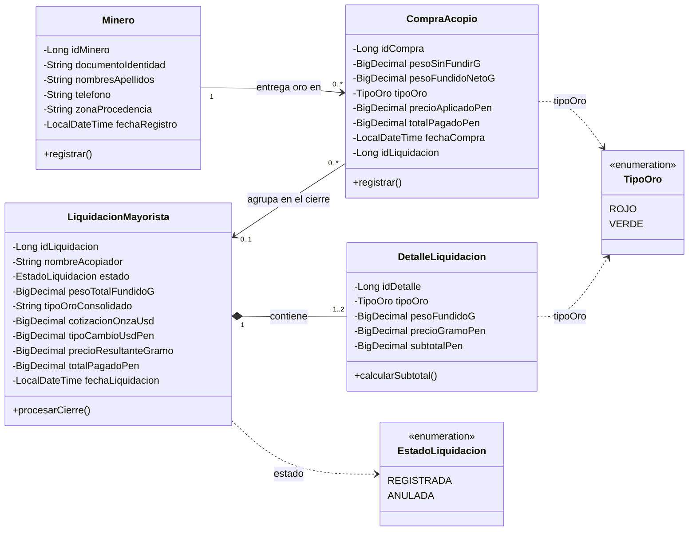

# ADS · Unidad 2, Sesión 01
## Diagrama de clases UML de SITRA-ORO

**Curso:** Análisis y Diseño de Sistemas  
**Tema:** Diagrama de clases UML  
**Equipo:** 05 · `sitra-oro`  
**Integrantes:** Helio Calisaya y Jhymel Nelio Figueroa Chambi

## Propósito

Representar las clases principales del dominio de acopio de oro con sus
atributos, operaciones y multiplicidades. En el diagrama se usan los nombres
funcionales **Compra de acopio** y **Liquidación mayorista**.

## Diagrama de clases

## Interpretación

- Cada rectángulo representa una clase. Sus atributos están en el segundo
  compartimento y sus operaciones en el tercero.
- `-` indica visibilidad privada y `+` visibilidad pública.
- Un minero puede registrar ninguna o varias compras; cada compra corresponde
  a un minero.
- Una liquidación mayorista contiene uno o dos detalles: uno para cada tipo de
  oro incluido en el cierre. El rombo negro representa composición.
- Una compra puede estar pendiente de cierre o quedar asociada a una
  liquidación. Una liquidación agrupa varias compras del stock que liquida.
- Las flechas discontinuas conectan cada clase con la enumeración que usa como
  tipo de atributo: compra y detalle usan `TipoOro`; liquidación usa
  `EstadoLiquidacion`. Son dependencias de tipo, no asociaciones entre objetos.
- `TipoOro` y `EstadoLiquidacion` son enumeraciones y cada una aparece una sola
  vez en el diagrama.

## Correspondencia con el código actual

Los nombres del diagrama describen el **dominio funcional**. El backend todavía
usa estos identificadores Java para persistir esos conceptos:

| Nombre del diagrama | Identificador Java actual |
|---|---|
| `CompraAcopio` | `TransaccionG2` |
| `LiquidacionMayorista` | `LiquidacionG1` |
| `DetalleLiquidacion` | `DetalleLiquidacionG1` |
| `Minero` | `Minero` |

La diferencia es intencional: el diagrama comunica el lenguaje funcional del
proyecto; la tabla permite rastrear las clases concretas del código mientras
se mantengan esos identificadores.

En el backend, `Minero` se relaciona con `TransaccionG2` mediante `@ManyToOne`.
`LiquidacionG1` contiene `DetalleLiquidacionG1` mediante `@OneToMany` con
cascada. La compra guarda el identificador de liquidación como `Long`, así que
su vínculo con la liquidación se representa como relación conceptual y no como
asociación ORM directa.

Las enumeraciones `TipoOro` y `EstadoLiquidacion` se muestran para explicar los
valores permitidos del dominio. En el código, el tipo de oro se almacena como
texto (`ROJO` o `VERDE`); `EstadoLiquidacion` sí es una enumeración Java.

No agregué una clase `Acopiador` con una asociación directa a la compra porque
la entidad de compra actual no persiste el identificador del acopiador ni del
centro. El nombre del acopiador aparece en la liquidación. Dibujar esa relación
como persistida afirmaría algo que el modelo actual no guarda.

Las operaciones `registrar`, `procesarCierre` y `calcularSubtotal` resumen
acciones del dominio para el diagrama didáctico; su lógica está implementada en
los servicios de aplicación, no como métodos con esos nombres en las entidades.

## Reglas del dominio

1. El peso fundido neto es mayor que cero y no supera el peso sin fundir.
2. El pago de una compra se obtiene multiplicando el peso neto por el precio
   aplicado por gramo.
3. El cierre registra el stock pendiente por tipo de oro y crea un detalle por
   cada tipo incluido.
4. No se repite el tipo de oro dentro de una misma liquidación.

## Fuente de la sesión

Material de clase: `ads/explica1_z7vksgjt7n.md` (UML, clases, atributos,
operaciones, visibilidad y multiplicidad).
