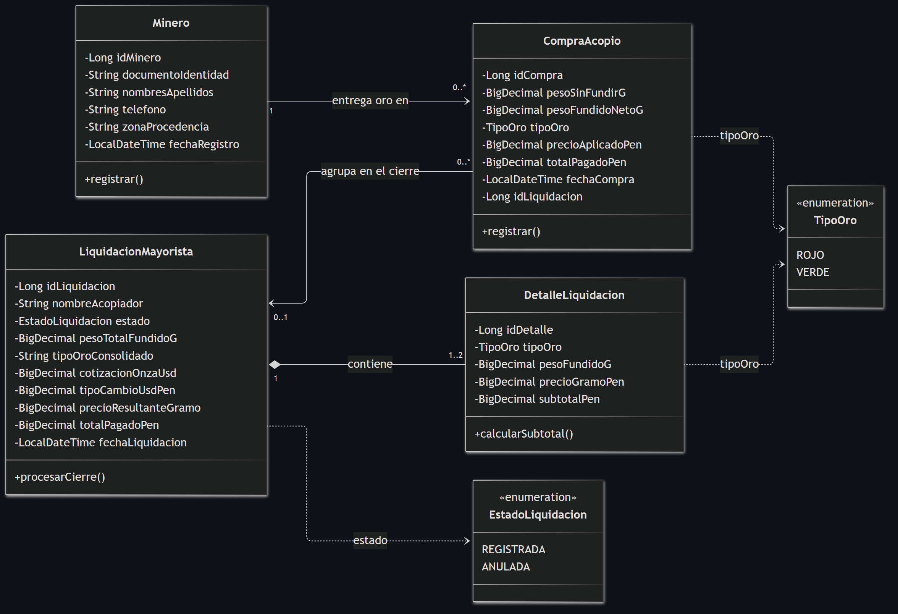
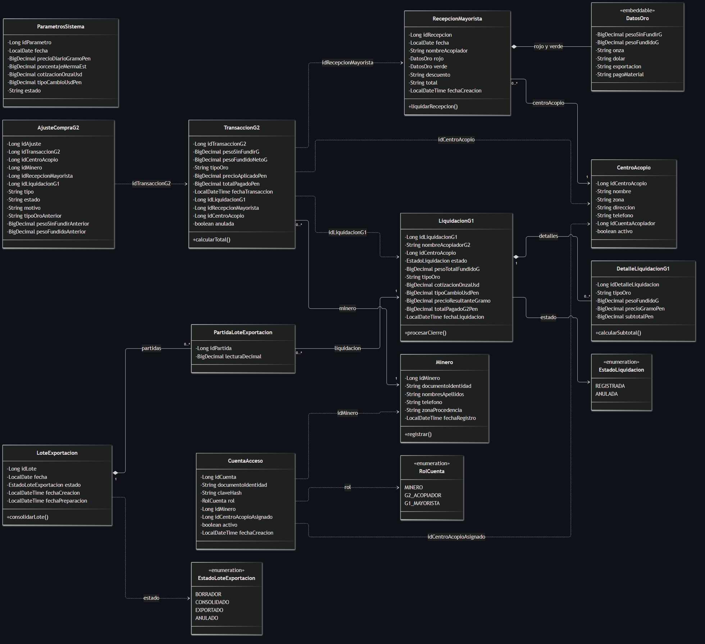

# SITRA-ORO · Decisiones de Diseño de Clases UML

**Curso:** Análisis y Diseño de Sistemas / Lenguaje de Programación II  
**Unidad:** Unidad 2 · Diagrama de Clases UML  
**Proyecto:** SITRA-ORO  

---

## 1. Diagrama 1: Dominio Central (Core)

Este diagrama representa el núcleo transaccional del acopio y liquidación de oro. Contiene **4 clases** y **2 enumeraciones**:

---

### 1.1. Clase `CompraAcopio`
| Decisión | Pregunta que resuelve | Aplicación en la clase |
|---|---|---|
| **Tipo concreto** | ¿Con qué tipo se representa cada atributo? | `pesoSinFundirG`, `pesoFundidoNetoG`, `precioAplicadoPen` y `totalPagadoPen` son `BigDecimal`; `fechaCompra` es `LocalDateTime`; `tipoOro` es `TipoOro`. |
| **Identidad** | ¿Cómo se identifica cada objeto? | `idCompra: Long`, autogenerado por secuencia de base de datos. |
| **Navegabilidad** | ¿Desde qué clase se puede llegar a la otra? | Navega hacia `Minero` (`1 --> 0..*`). No navega por objeto a la liquidación. |
| **Enumeraciones** | ¿Qué valores admite un atributo de estado o tipo? | `tipoOro` usa la enumeración `TipoOro` (`ROJO`, `VERDE`). |
| **Referencia entre módulos** | ¿Una clase de otro módulo se referencia por objeto o por identificador? | Guarda `idLiquidacion: Long`, no una referencia de objeto a `LiquidacionMayorista`. |
| **Atributo derivado** | ¿Se calcula cada vez o se guarda? | `totalPagadoPen` se calcula (`pesoFundidoNetoG * precioAplicadoPen`) y se guarda en base de datos. |
| **Ubicación de la operación** | ¿La regla vive en la entidad o en un servicio? | La regla y cálculo residen en el método `registrar()` de la entidad. |

---

### 1.2. Clase `Minero` (Core)
| Decisión | Pregunta que resuelve | Aplicación en la clase |
|---|---|---|
| **Tipo concreto** | ¿Con qué tipo se representa cada atributo? | `documentoIdentidad`, `nombresApellidos`, `telefono` y `zonaProcedencia` son `String`; `fechaRegistro` es `LocalDateTime`. |
| **Identidad** | ¿Cómo se identifica cada objeto? | `idMinero: Long`, autogenerado por secuencia de base de datos. |
| **Navegabilidad** | ¿Desde qué clase se puede llegar a la otra? | No tiene lista de compras en memoria; la relación es unidireccional desde `CompraAcopio`. |
| **Enumeraciones** | ¿Qué valores admite un atributo de estado o tipo? | No utiliza enumeraciones; maneja datos maestros descriptivos. |
| **Referencia entre módulos** | ¿Una clase de otro módulo se referencia por objeto o por identificador? | Se referencia por objeto desde `CompraAcopio` mediante clave foránea. |
| **Atributo derivado** | ¿Se calcula cada vez o se guarda? | No tiene atributos calculados ni derivados. |
| **Ubicación de la operación** | ¿La regla vive en la entidad o en un servicio? | La operación `registrar()` gestiona el alta del minero. |

---

### 1.3. Clase `LiquidacionMayorista`
| Decisión | Pregunta que resuelve | Aplicación en la clase |
|---|---|---|
| **Tipo concreto** | ¿Con qué tipo se representa cada atributo? | `cotizacionOnzaUsd`, `tipoCambioUsdPen`, `precioResultanteGramo`, `pesoTotalFundidoG` y `totalPagadoPen` son `BigDecimal`; `fechaLiquidacion` es `LocalDateTime`; `estado` es `EstadoLiquidacion`. |
| **Identidad** | ¿Cómo se identifica cada objeto? | `idLiquidacion: Long`, autogenerado por secuencia de base de datos. |
| **Navegabilidad** | ¿Desde qué clase se puede llegar a la otra? | Contiene y navega a su colección de `DetalleLiquidacion` (`1 *-- 1..2`). |
| **Enumeraciones** | ¿Qué valores admite un atributo de estado o tipo? | `estado` usa la enumeración `EstadoLiquidacion` (`REGISTRADA`, `ANULADA`). |
| **Referencia entre módulos** | ¿Una clase de otro módulo se referencia por objeto o por identificador? | Agrupa compras mediante el identificador `idLiquidacion` registrado en ellas. |
| **Atributo derivado** | ¿Se calcula cada vez o se guarda? | `totalPagadoPen` y `pesoTotalFundidoG` se consolidan sumando los detalles y se guardan. |
| **Ubicación de la operación** | ¿La regla vive en la entidad o en un servicio? | `procesarCierre()` valida las restricciones y totaliza dentro de la clase. |

---

### 1.4. Clase `DetalleLiquidacion`
| Decisión | Pregunta que resuelve | Aplicación en la clase |
|---|---|---|
| **Tipo concreto** | ¿Con qué tipo se representa cada atributo? | `pesoFundidoG`, `precioGramoPen` y `subtotalPen` son `BigDecimal`; `tipoOro` es `TipoOro`. |
| **Identidad** | ¿Cómo se identifica cada objeto? | `idDetalle: Long`, autogenerado por secuencia de base de datos. |
| **Navegabilidad** | ¿Desde qué clase se puede llegar a la otra? | Es un componente dependiente de `LiquidacionMayorista`; no navega externamente. |
| **Enumeraciones** | ¿Qué valores admite un atributo de estado o tipo? | `tipoOro` usa la enumeración `TipoOro` (`ROJO`, `VERDE`). |
| **Referencia entre módulos** | ¿Una clase de otro módulo se referencia por objeto o por identificador? | Pertenece estrictamente al módulo de liquidación. |
| **Atributo derivado** | ¿Se calcula cada vez o se guarda? | `subtotalPen` se calcula (`pesoFundidoG * precioGramoPen`) y se persiste. |
| **Ubicación de la operación** | ¿La regla vive en la entidad o en un servicio? | `calcularSubtotal()` vive como método de la entidad detalle. |

---

## 2. Diagrama 2: Todo el Proyecto (12 Clases del Backend)

Este diagrama representa el sistema completo implementado en el backend Spring Boot / JPA. Contiene **12 clases/estructuras** y **3 enumeraciones**:

---

### 2.1. Clase `TransaccionG2`
| Decisión | Pregunta que resuelve | Aplicación en la clase |
|---|---|---|
| **Tipo concreto** | ¿Con qué tipo se representa cada atributo? | `pesoSinFundirG`, `pesoFundidoNetoG`, `precioAplicadoPen` y `totalPagadoPen` son `BigDecimal`; `fechaTransaccion` es `LocalDateTime`; `tipoOro` es `String`; `anulada` es `boolean`. |
| **Identidad** | ¿Cómo se identifica cada objeto? | `idTransaccionG2: Long`, clave primaria autogenerada en Oracle. |
| **Navegabilidad** | ¿Desde qué clase se puede llegar a la otra? | Navega hacia `Minero` con `@ManyToOne`. |
| **Enumeraciones** | ¿Qué valores admite un atributo de estado o tipo? | `tipoOro` es `String` restringido por servicio a `"ROJO"` o `"VERDE"` (sin enum Java). |
| **Referencia entre módulos** | ¿Una clase de otro módulo se referencia por objeto o por identificador? | Guarda `idLiquidacionG1`, `idRecepcionMayorista` e `idCentroAcopio` como `Long`. |
| **Atributo derivado** | ¿Se calcula cada vez o se guarda? | `totalPagadoPen` se calcula y se guarda de forma inmutable. |
| **Ubicación de la operación** | ¿La regla vive en la entidad o en un servicio? | La regla de pesaje y cálculo vive en `AcopiadorServiceImpl`; la entidad guarda el estado JPA. |

---

### 2.2. Clase `Minero` (Completo)
| Decisión | Pregunta que resuelve | Aplicación en la clase |
|---|---|---|
| **Tipo concreto** | ¿Con qué tipo se representa cada atributo? | `documentoIdentidad`, `nombresApellidos`, `telefono` y `zonaProcedencia` son `String`; `fechaRegistro` es `LocalDateTime`. |
| **Identidad** | ¿Cómo se identifica cada objeto? | `idMinero: Long`, clave primaria autogenerada en Oracle. |
| **Navegabilidad** | ¿Desde qué clase se puede llegar a la otra? | Relación unidireccional sin `@OneToMany` hacia transacciones para evitar saturar memoria. |
| **Enumeraciones** | ¿Qué valores admite un atributo de estado o tipo? | Sin enumeraciones; datos de registro civil y ubicación. |
| **Referencia entre módulos** | ¿Una clase de otro módulo se referencia por objeto o por identificador? | Es referenciado por objeto desde `TransaccionG2` y por `idMinero` desde `CuentaAcceso`. |
| **Atributo derivado** | ¿Se calcula cada vez o se guarda? | No maneja atributos calculados. |
| **Ubicación de la operación** | ¿La regla vive en la entidad o en un servicio? | `MineroServiceImpl` valida unicidad de documento y formato. |

---

### 2.3. Clase `LiquidacionG1`
| Decisión | Pregunta que resuelve | Aplicación en la clase |
|---|---|---|
| **Tipo concreto** | ¿Con qué tipo se representa cada atributo? | `cotizacionOnzaUsd`, `tipoCambioUsdPen`, `precioResultanteGramo`, `pesoTotalFundidoG` y `totalPagadoG2Pen` son `BigDecimal`; `fechaLiquidacion` es `LocalDateTime`; `estado` es `EstadoLiquidacion`. |
| **Identidad** | ¿Cómo se identifica cada objeto? | `idLiquidacionG1: Long`, autogenerado por secuencia Oracle. |
| **Navegabilidad** | ¿Desde qué clase se puede llegar a la otra? | Navega a su lista de `DetalleLiquidacionG1` con `@OneToMany(cascade = ALL)`. |
| **Enumeraciones** | ¿Qué valores admite un atributo de estado o tipo? | `estado` usa el enum `EstadoLiquidacion` (`REGISTRADA`, `ANULADA`). |
| **Referencia entre módulos** | ¿Una clase de otro módulo se referencia por objeto o por identificador? | Se vincula con transacciones actualizando el campo `idLiquidacionG1` de las compras. |
| **Atributo derivado** | ¿Se calcula cada vez o se guarda? | `totalPagadoG2Pen` se calcula sumando los detalles y se guarda. |
| **Ubicación de la operación** | ¿La regla vive en la entidad o en un servicio? | `MayoristaServiceImpl` valida cotizaciones y ejecuta el cierre. |

---

### 2.4. Clase `DetalleLiquidacionG1`
| Decisión | Pregunta que resuelve | Aplicación en la clase |
|---|---|---|
| **Tipo concreto** | ¿Con qué tipo se representa cada atributo? | `pesoFundidoG`, `precioGramoPen` y `subtotalPen` son `BigDecimal`; `tipoOro` es `String`. |
| **Identidad** | ¿Cómo se identifica cada objeto? | `idDetalleLiquidacion: Long`, autogenerado por secuencia Oracle. |
| **Navegabilidad** | ¿Desde qué clase se puede llegar a la otra? | Conoce a su liquidación cabecera `LiquidacionG1` con `@ManyToOne`. |
| **Enumeraciones** | ¿Qué valores admite un atributo de estado o tipo? | `tipoOro` admite `"ROJO"` o `"VERDE"`. |
| **Referencia entre módulos** | ¿Una clase de otro módulo se referencia por objeto o por identificador? | Es interno al módulo de liquidación mayorista. |
| **Atributo derivado** | ¿Se calcula cada vez o se guarda? | `subtotalPen` se calcula (`pesoFundidoG * precioGramoPen`) y se persiste. |
| **Ubicación de la operación** | ¿La regla vive en la entidad o en un servicio? | `MayoristaServiceImpl` desglosa y genera los detalles por color. |

---

### 2.5. Clase `RecepcionMayorista`
| Decisión | Pregunta que resuelve | Aplicación en la clase |
|---|---|---|
| **Tipo concreto** | ¿Con qué tipo se representa cada atributo? | `fecha` es `LocalDate`; `nombreAcopiador` es `String`; `descuento` (adelanto en soles) y `total` son numéricos; `fechaCreacion` es `LocalDateTime`. |
| **Identidad** | ¿Cómo se identifica cada objeto? | `idRecepcion: Long`, autogenerado por secuencia Oracle. |
| **Navegabilidad** | ¿Desde qué clase se puede llegar a la otra? | Navega hacia `CentroAcopio` con `@ManyToOne` y embebe dos objetos `DatosOro`. |
| **Enumeraciones** | ¿Qué valores admite un atributo de estado o tipo? | No tiene enum directo; sus estados se controlan al vincularse con lotes. |
| **Referencia entre módulos** | ¿Una clase de otro módulo se referencia por objeto o por identificador? | Asocia compras del acopiador vinculando su `idRecepcionMayorista`. |
| **Atributo derivado** | ¿Se calcula cada vez o se guarda? | `pagoMaterial` y `total` (restando el adelanto en soles) se calculan y se guardan. |
| **Ubicación de la operación** | ¿La regla vive en la entidad o en un servicio? | `RecepcionMayoristaServiceImpl` valida la recepción y la segunda fundición. |

---

### 2.6. Clase `DatosOro` (Embeddable)
| Decisión | Pregunta que resuelve | Aplicación en la clase |
|---|---|---|
| **Tipo concreto** | ¿Con qué tipo se representa cada atributo? | `pesoSinFundirG` y `pesoFundidoG` son `BigDecimal`; `onza`, `dolar`, `exportacion` y `pagoMaterial` son descriptores numéricos. |
| **Identidad** | ¿Cómo se identifica cada objeto? | No tiene ID propio; comparte la identidad de `RecepcionMayorista` (`@Embeddable`). |
| **Navegabilidad** | ¿Desde qué clase se puede llegar a la otra? | Es un objeto de valor dentro de `RecepcionMayorista` (campo `rojo` y `verde`). |
| **Enumeraciones** | ¿Qué valores admite un atributo de estado o tipo? | Representa la estructura de pesaje y cotización por color. |
| **Referencia entre módulos** | ¿Una clase de otro módulo se referencia por objeto o por identificador? | Es interno a la recepción mayorista. |
| **Atributo derivado** | ¿Se calcula cada vez o se guarda? | El cálculo de merma y pago por color se almacena como foto en sus campos. |
| **Ubicación de la operación** | ¿La regla vive en la entidad o en un servicio? | Los cálculos de fundición mayorista se realizan en el servicio de recepción. |

---

### 2.7. Clase `CentroAcopio`
| Decisión | Pregunta que resuelve | Aplicación en la clase |
|---|---|---|
| **Tipo concreto** | ¿Con qué tipo se representa cada atributo? | `nombre`, `zona`, `direccion`, `telefono` son `String`; `activo` es `boolean`. |
| **Identidad** | ¿Cómo se identifica cada objeto? | `idCentroAcopio: Long`, autogenerado por secuencia Oracle. |
| **Navegabilidad** | ¿Desde qué clase se puede llegar a la otra? | Recibe referencias `@ManyToOne` desde `RecepcionMayorista`; no lista recepciones en memoria. |
| **Enumeraciones** | ¿Qué valores admite un atributo de estado o tipo? | Estado mediante flag booleano `activo`. |
| **Referencia entre módulos** | ¿Una clase de otro módulo se referencia por objeto o por identificador? | Guarda `idCuentaAcopiador: Long` para vincular con el usuario sin acoplar JPA. |
| **Atributo derivado** | ¿Se calcula cada vez o se guarda? | No maneja atributos derivados; es un catálogo operativo. |
| **Ubicación de la operación** | ¿La regla vive en la entidad o en un servicio? | `CentroAcopioServiceImpl` valida la unicidad de nombre por zona. |

---

### 2.8. Clase `ParametrosSistema`
| Decisión | Pregunta que resuelve | Aplicación en la clase |
|---|---|---|
| **Tipo concreto** | ¿Con qué tipo se representa cada atributo? | `fecha` es `LocalDate`; `precioDiarioGramoPen`, `porcentajeMermaEst`, `cotizacionOnzaUsd` y `tipoCambioUsdPen` son `BigDecimal`; `estado` es `String`. |
| **Identidad** | ¿Cómo se identifica cada objeto? | `idParametro: Long`, autogenerado por secuencia Oracle. |
| **Navegabilidad** | ¿Desde qué clase se puede llegar a la otra? | Tabla autónoma; no tiene navegabilidad directa por JPA con otras entidades. |
| **Enumeraciones** | ¿Qué valores admite un atributo de estado o tipo? | `estado` maneja valores `"ACTIVO"` / `"INACTIVO"`. |
| **Referencia entre módulos** | ¿Una clase de otro módulo se referencia por objeto o por identificador? | Es consultado como servicio transversal por acopiadores y mayoristas. |
| **Atributo derivado** | ¿Se calcula cada vez o se guarda? | No tiene atributos derivados; son parámetros de referencia del día. |
| **Ubicación de la operación** | ¿La regla vive en la entidad o en un servicio? | `ParametrosSistemaServiceImpl` valida la vigencia de la cotización. |

---

### 2.9. Clase `AjusteCompraG2`
| Decisión | Pregunta que resuelve | Aplicación en la clase |
|---|---|---|
| **Tipo concreto** | ¿Con qué tipo se representa cada atributo? | `pesoSinFundirAnterior` y `pesoFundidoAnterior` son `BigDecimal`; `tipo`, `estado` y `motivo` son `String`. |
| **Identidad** | ¿Cómo se identifica cada objeto? | `idAjuste: Long`, autogenerado por secuencia Oracle. |
| **Navegabilidad** | ¿Desde qué clase se puede llegar a la otra? | No tiene relaciones JPA directas; almacena identificadores escalares. |
| **Enumeraciones** | ¿Qué valores admite un atributo de estado o tipo? | `tipo` y `estado` se restringen por reglas del acopio en `String`. |
| **Referencia entre módulos** | ¿Una clase de otro módulo se referencia por objeto o por identificador? | Guarda `idTransaccionG2`, `idCentroAcopio`, `idMinero`, `idRecepcionMayorista` e `idLiquidacionG1` como `Long`. |
| **Atributo derivado** | ¿Se calcula cada vez o se guarda? | Guarda snapshots históricos de pesos anteriores como foto inmutable. |
| **Ubicación de la operación** | ¿La regla vive en la entidad o en un servicio? | `AjusteCompraServiceImpl` registra la auditoría y valida motivos. |

---

### 2.10. Clase `LoteExportacion`
| Decisión | Pregunta que resuelve | Aplicación en la clase |
|---|---|---|
| **Tipo concreto** | ¿Con qué tipo se representa cada atributo? | `fecha` es `LocalDate`; `fechaCreacion` y `fechaPreparacion` son `LocalDateTime`; `estado` es `EstadoLoteExportacion`. |
| **Identidad** | ¿Cómo se identifica cada objeto? | `idLote: Long`, autogenerado por secuencia Oracle. |
| **Navegabilidad** | ¿Desde qué clase se puede llegar a la otra? | Navega a su colección de `PartidaLoteExportacion` con `@OneToMany(cascade = ALL)`. |
| **Enumeraciones** | ¿Qué valores admite un atributo de estado o tipo? | `estado` usa el enum `EstadoLoteExportacion` (`BORRADOR`, `CONSOLIDADO`, `EXPORTADO`, `ANULADO`). |
| **Referencia entre módulos** | ¿Una clase de otro módulo se referencia por objeto o por identificador? | Agrupa liquidaciones mediante las partidas que asocia. |
| **Atributo derivado** | ¿Se calcula cada vez o se guarda? | Los totales consolidados de exportación se derivan sumando las partidas. |
| **Ubicación de la operación** | ¿La regla vive en la entidad o en un servicio? | `LoteExportacionServiceImpl` valida el paso de borrador a exportado. |

---

### 2.11. Clase `PartidaLoteExportacion`
| Decisión | Pregunta que resuelve | Aplicación en la clase |
|---|---|---|
| **Tipo concreto** | ¿Con qué tipo se representa cada atributo? | `lecturaDecimal` es `BigDecimal`. |
| **Identidad** | ¿Cómo se identifica cada objeto? | `idPartida: Long`, autogenerado por secuencia Oracle. |
| **Navegabilidad** | ¿Desde qué clase se puede llegar a la otra? | Navega hacia `LoteExportacion` y hacia `LiquidacionG1` con `@ManyToOne`. |
| **Enumeraciones** | ¿Qué valores admite un atributo de estado o tipo? | No maneja estados propios; depende del lote contenedor. |
| **Referencia entre módulos** | ¿Una clase de otro módulo se referencia por objeto o por identificador? | Conecta la liquidación con el lote de exportación. |
| **Atributo derivado** | ¿Se calcula cada vez o se guarda? | `lecturaDecimal` se calcula a partir de leyes de pureza y se almacena fija. |
| **Ubicación de la operación** | ¿La regla vive en la entidad o en un servicio? | Valida en servicio que una liquidación no se duplique en dos partidas (`UQ_LOTE_PART_LIQ`). |

---

### 2.12. Clase `CuentaAcceso`
| Decisión | Pregunta que resuelve | Aplicación en la clase |
|---|---|---|
| **Tipo concreto** | ¿Con qué tipo se representa cada atributo? | `documentoIdentidad` y `claveHash` son `String`; `rol` es `RolCuenta`; `activo` es `boolean`; `fechaCreacion` es `LocalDateTime`. |
| **Identidad** | ¿Cómo se identifica cada objeto? | `idCuenta: Long`, autogenerado en Oracle (con restricción única en `documentoIdentidad`). |
| **Navegabilidad** | ¿Desde qué clase se puede llegar a la otra? | Módulo de seguridad aislado; no mantiene relaciones JPA hacia entidades de negocio. |
| **Enumeraciones** | ¿Qué valores admite un atributo de estado o tipo? | `rol` usa el enum `RolCuenta` (`MINERO`, `G2_ACOPIADOR`, `G1_MAYORISTA`). |
| **Referencia entre módulos** | ¿Una clase de otro módulo se referencia por objeto o por identificador? | Guarda `idMinero` e `idCentroAcopioAsignado` como identificadores numéricos `Long`. |
| **Atributo derivado** | ¿Se calcula cada vez o se guarda? | No maneja atributos derivados. |
| **Ubicación de la operación** | ¿La regla vive en la entidad o en un servicio? | `CuentaAccesoServiceImpl` y `SecurityConfig` manejan hash bcrypt y tokens JWT. |
