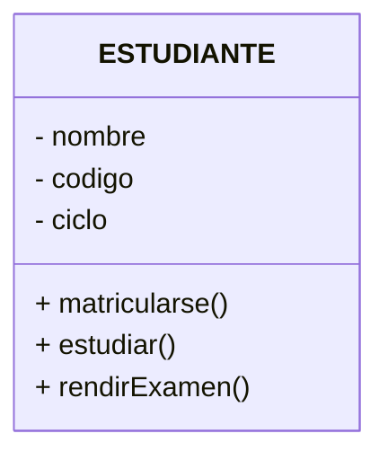
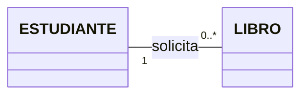

# Universidad Peruana Unión
## Escuela Profesional de Ingeniería de Sistemas

**Docente:** Mg. Nélida Huamán Paco  
**Curso:** Análisis y Diseño de Sistemas / Lenguaje de Programación II  
**Unidad:** Unidad 2  
**Sesión:** Sesión 01  
**Tema:** Diagrama de Clases UML  

---

## Diapositiva 1: Portada
- **Carrera:** EP Ingeniería de Sistemas
- **Docente:** Mg. Nélida Huamán Paco
- **Tema:** Diagrama de clases UML
- **Unidad:** UNIDAD 2
- **Sesión:** Sesión 01

---

## Diapositiva 2: Fase
### EXPLICA

---

## Diapositiva 3: ¿Qué es UML?

**UML** significa: **Unified Modeling Language** (*Lenguaje Unificado de Modelado*).

Es un lenguaje que permite **representar gráficamente un sistema antes de programarlo**.

Podemos pensar en UML como el **plano de una casa**:
* Antes de construir una casa, hacemos un plano.
* Antes de desarrollar un sistema complejo, podemos hacer modelos UML.

---

## Diapositiva 4: Ejemplo Introductorio

Antes de programar un **Sistema de Biblioteca**, podemos analizar:
* ¿Qué objetos existen?
* ¿Qué información tiene cada objeto?
* ¿Qué acciones puede realizar?
* ¿Cómo se relacionan?

---

## Diapositiva 5: ¿Qué es un Diagrama de Clases?

El **diagrama de clases** es uno de los diagramas más importantes de UML. Permite representar:
* **Clases**
* **Atributos**
* **Métodos**
* **Relaciones entre clases**

> **En palabras sencillas:**  
> El diagrama de clases nos muestra **qué objetos existen en nuestro sistema y cómo se relacionan entre ellos**.

---

## Diapositiva 6: ¿Qué es una Clase? (Concepto del mundo real)

Antes de hablar de UML, pensemos en la vida real. Tenemos:
* Ana
* Carlos
* María

Los tres son **personas**. Entonces podemos crear una clase: **PERSONA**.

* La clase funciona como un **molde**.
* La clase define las características y comportamientos que tendrán sus objetos.

---

## Diapositiva 7: ¿Qué es un OBJETO?

Un objeto es una **instancia de una clase**.

* **CLASE:** Persona
* **OBJETOS:**
  * Ana
  * Carlos
  * María

---

## Diapositiva 8: ¿Cómo se representa una clase en UML?

Una clase se representa mediante un **rectángulo dividido en tres partes**:

1. **Superior:** Nombre de la clase.
2. **Medio:** Atributos (características de la clase).
3. **Inferior:** Métodos (acciones que puede realizar el objeto).

### Modificadores de Acceso (Visibilidad)
* `+` : Público
* `-` : Privado

### Ejemplo: Clase `ESTUDIANTE`



```text
┌─────────────────────────────────┐
│           ESTUDIANTE            │
├─────────────────────────────────┤
│ - nombre                        │
│ - codigo                        │
│ - ciclo                         │
├─────────────────────────────────┤
│ + matricularse()                │
│ + estudiar()                    │
│ + rendirExamen()                │
└─────────────────────────────────┘
```

---

## Diapositiva 9: Multiplicidad

La **multiplicidad** nos permite indicar cuántos objetos participan en una relación.

### Ejemplo

$$\text{ESTUDIANTE } 1 \text{ ───────── } 0..* \text{ LIBRO}$$



> **Interpretación:**  
> Un estudiante puede solicitar **cero o muchos** libros.

### Símbolos más utilizados

| Símbolo | Significado |
| :---: | :--- |
| `1` | Uno |
| `0..1` | Cero o uno |
| `0..*` | Cero o muchos |
| `1..*` | Uno o muchos |
