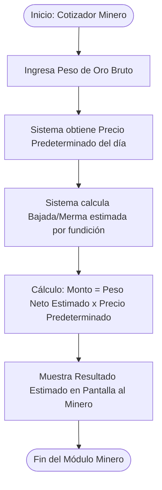
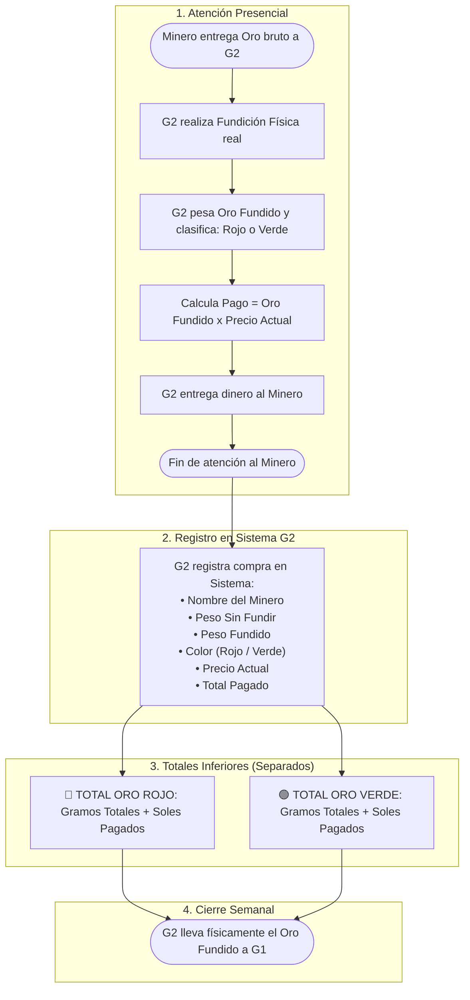
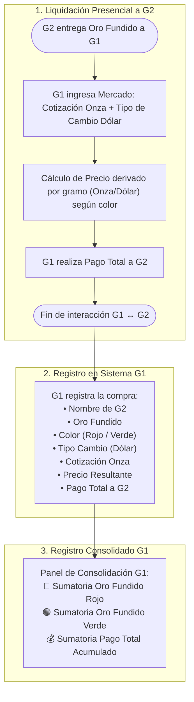
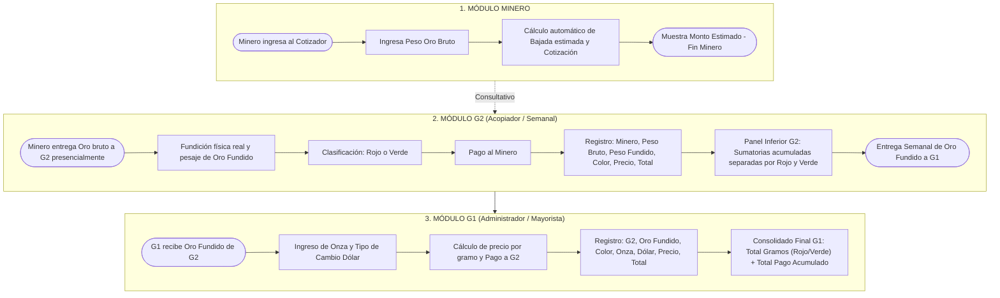

# INFORME DE INGENIERÍA DE REQUERIMIENTOS
## SISTEMA DE CONTROL Y ACOPIO DE ORO (MÓDULOS: MINERO | G2 | G1)

---

## 1. INTRODUCCIÓN Y OBJETIVO GENERAL

El presente documento establece la especificación formal de requerimientos para el desarrollo del **Sistema Automatizado de Acopio y Liquidación de Oro**. El objetivo principal del sistema es reemplazar los cálculos manuales y desorganizados por un flujo digital estandarizado, garantizando trazabilidad, precisión en las liquidaciones financieras y un control claro entre los tres actores principales de la cadena: **Minero**, **Acopiador (G2)** y **Administrador Mayorista (G1)**.

---

## 2. ESTRUCTURA MODULAR DEL SISTEMA

### 2.1 Módulo 1: Minero (Cotizador Estimativo / Consulta Rápida)
* **Propósito:** Brindar al minero una estimación previa y transparente del valor de su mineral antes de acudir presencialmente al acopio.
* **Entradas del Usuario:**
  * Peso del oro bruto (sin fundir) en gramos.
* **Datos del Sistema:**
  * Precio predeterminado del gramo de oro del día (fijado por el sistema).
* **Procesamiento y Fórmulas:**
  1. **Estimación de Fundición / Merma:** El sistema calcula la reducción estimada que tendrá el mineral al quemarse (ejemplo: reducción de 20g bruto a 19g neto estimado).
  2. **Cálculo de Cotización:**
     $$\text{Monto Estimado} = \text{Peso Neto Estimado (g)} \times \text{Precio Predeterminado del Día (S/.)}$$
* **Salida:** Muestra en pantalla el monto total estimado que recibiría el minero.
* **Delimitación:** La sesión e interacción del módulo Minero **concluye inmediatamente** al mostrar esta cotización.

---

### 2.2 Módulo 2: G2 (Acopiador Directo / Operación y Control Semanal)
* **Propósito:** Gestionar la recepción física del oro bruto, realizar la fundición real, liquidar el pago directo al minero y consolidar los acumulados semanales.

#### A. Flujo de Atención y Pago al Minero (Presencial)
1. **Fundición Real:** G2 recibe el oro bruto sin fundir y realiza la fundición física.
2. **Pesaje y Clasificación:** Se obtiene el peso real del oro fundido (neto) y se clasifica según su tipo/color:
   * 🔴 **Oro Rojo**
   * 🟢 **Oro Verde**
3. **Liquidación y Pago:** 
   $$\text{Pago al Minero} = \text{Peso Oro Fundido Real (g)} \times \text{Precio del Oro Actual (S/.)}$$
4. **Fin de Atención:** G2 entrega el dinero al minero. Aquí termina la interacción presencial con el minero.

#### B. Registro de Transacción en Sistema G2
Para cada compra realizada, G2 registra los siguientes campos obligatorios:
* Nombre del Minero.
* Peso del Oro Sin Fundir (bruto inicial).
* Peso del Oro Fundido (neto real).
* Tipo / Color de Oro (🔴 Rojo o 🟢 Verde).
* Precio del Oro Actual aplicado.
* Pago Total realizado.

#### C. Consolidación de Totales (Panel Inferior G2)
En la parte inferior de la pantalla de G2, el sistema calcula de forma automática y muestra las sumatorias acumuladas, **estrictamente separadas por tipo de oro**:
* 🔴 **Resumen Oro Rojo:** Suma total de gramos fundidos rojos + Suma total de dinero pagado.
* 🟢 **Resumen Oro Verde:** Suma total de gramos fundidos verdes + Suma total de dinero pagado.

#### D. Cierre Semanal
Al término de la semana, G2 acude presencialmente donde G1 con el lote de oro fundido (separado por colores) para solicitar la liquidación semanal. Aquí concluye el módulo G2.

---

### 2.3 Módulo 3: G1 (Administrador Mayorista / Consolidación Final)
* **Propósito:** Liquidar semanalmente el oro procesado entregado por G2, registrando las cotizaciones del mercado internacional y consolidando las cuentas generales del negocio.

#### A. Recepción Presencial y Cálculo de Pago a G2
1. G1 recibe presencialmente el oro fundido entregado por G2 (clasificado por color).
2. G1 ingresa los datos actuales del mercado:
   * **Cotización de la Onza de Oro**.
   * **Tipo de Cambio (Dólar)**.
3. El sistema determina el precio unitario por gramo resultante entre la Onza y el Dólar, diferenciado según el tipo/color de oro (🔴 Rojo / 🟢 Verde).
4. G1 efectúa el pago a G2 según los gramos netos entregados y el precio derivado.
5. **Fin de Interacción:** Con el pago a G2 concluye la transacción presencial.

#### B. Registro de Transacción en Sistema G1
G1 almacena en su módulo:
* Nombre del G2 (proveedor/acopiador).
* Peso del Oro Fundido entregado.
* Color del Oro (🔴 Rojo / 🟢 Verde de forma separada).
* Tipo de Cambio del Dólar aplicado.
* Valor de la Onza de Oro.
* Precio por gramo resultante (Onza / Dólar).
* Resultado de Compra y **Pago Total realizado a G2**.

#### C. Registro Consolidado Final (G1)
El sistema genera un panel de control consolidado para G1 que muestra:
* 🔴 Sumatoria total acumulada de Oro Fundido Rojo.
* 🟢 Sumatoria total acumulada de Oro Fundido Verde.
* 💰 Sumatoria total acumulada de dinero desembolsado por G1.

---

## 3. DIAGRAMAS DE FLUJO Y PROCESOS

### 3.1 Diagrama del Módulo Minero

---

### 3.2 Diagrama del Módulo G2

---

### 3.3 Diagrama del Módulo G1

---

### 3.4 Diagrama Integral End-to-End (Sistema Completo)

---

## 4. REQUERIMIENTOS NO FUNCIONALES Y REGLAS DE SEGURIDAD

1. **Separación Estricta de Categorías:** En los módulos G2 y G1, el Oro Rojo y el Oro Verde **jamás deben mezclarse en los totales**, debido a sus diferencias de valorización y pureza.
2. **Seguridad y Control de Acceso (RBAC):**
   * **Minero:** Acceso libre de consulta sin credenciales complejas.
   * **G2 y G1:** Acceso restringido mediante usuario y contraseña segura por manejar registros financieros.
3. **Consistencia de Datos:** Toda liquidación debe actualizar automáticamente las sumatorias acumuladas en tiempo real.
4. **Usabilidad:** Interfaz clara y legible para operar fácilmente desde dispositivos móviles o laptops en zonas de acopio.
