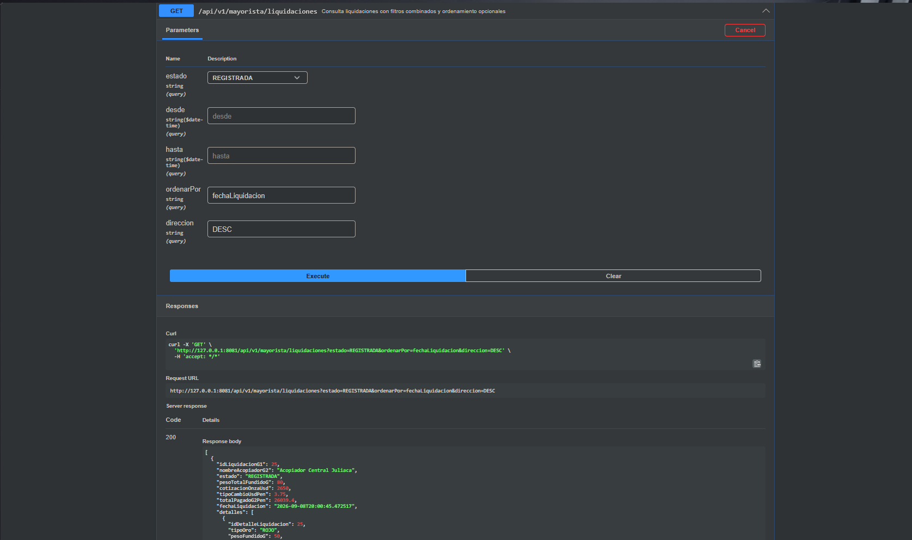
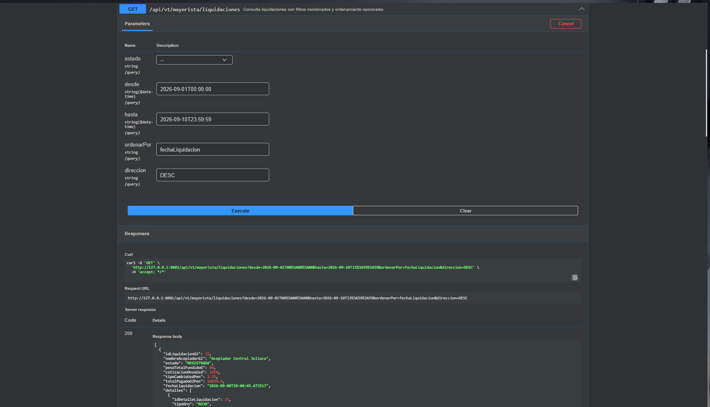
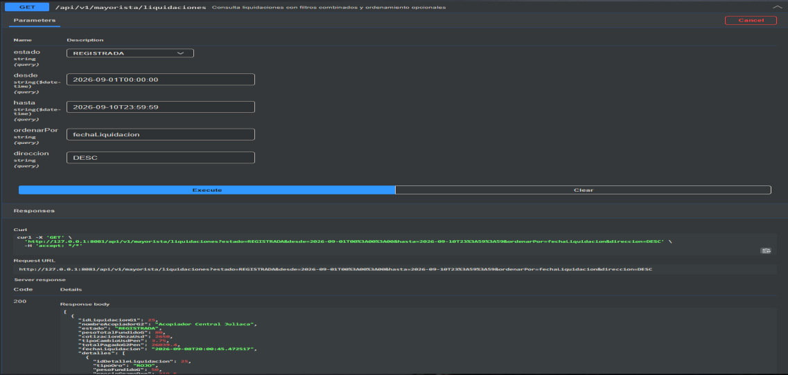
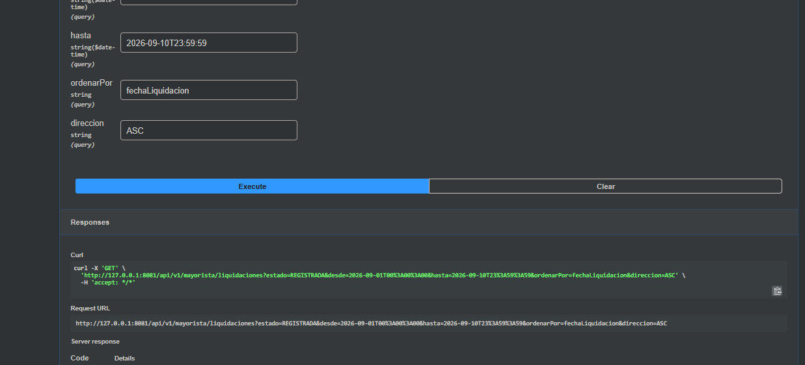
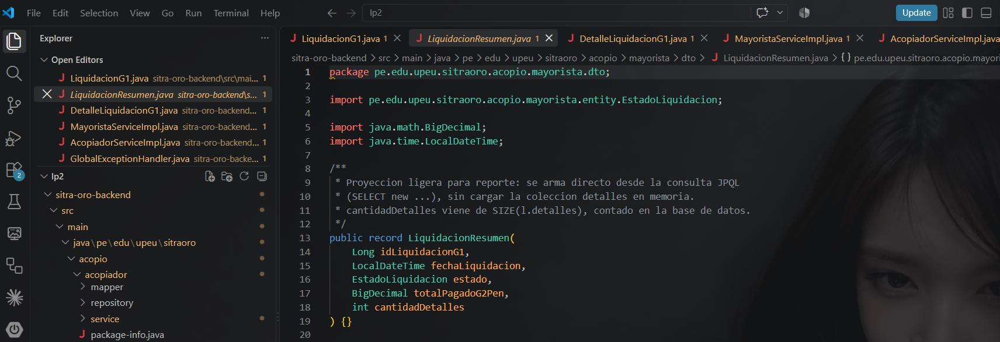
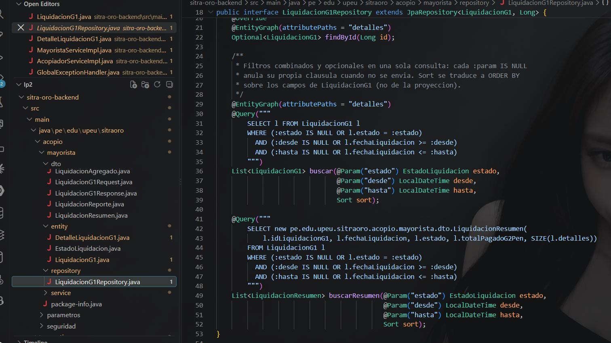
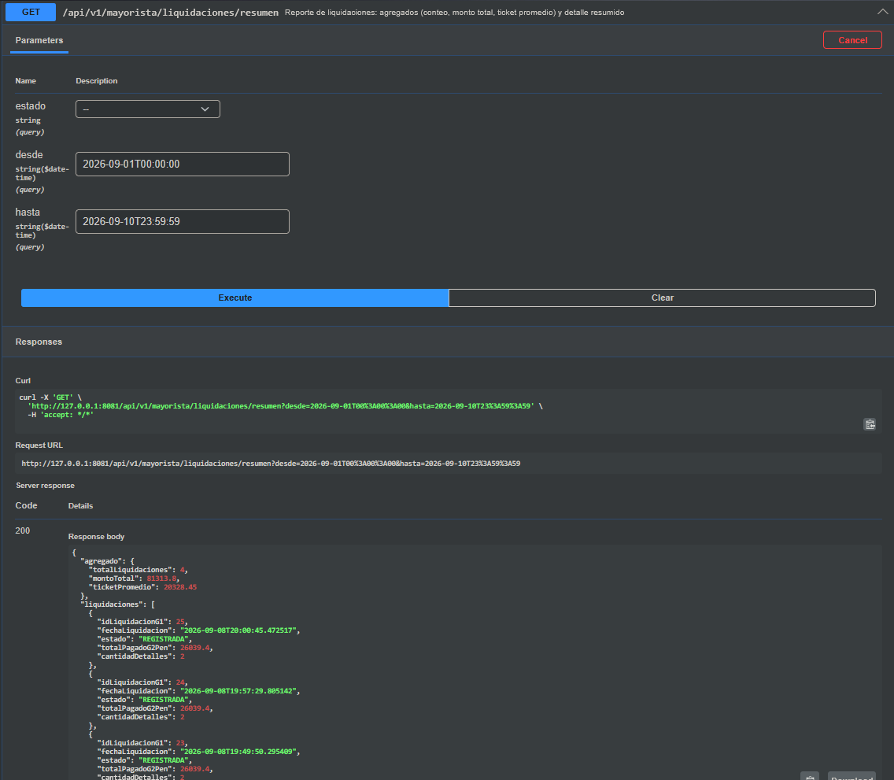
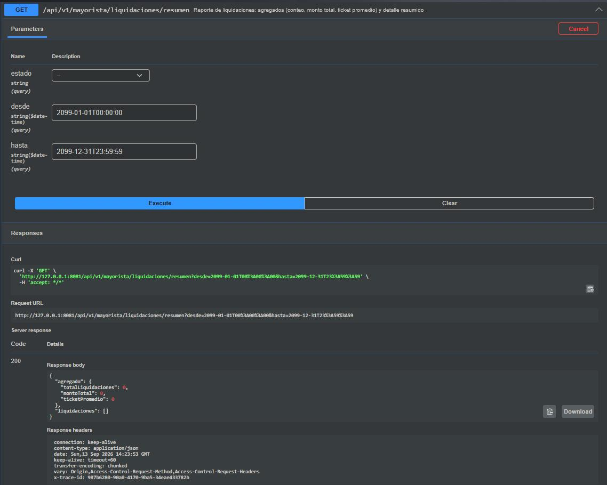
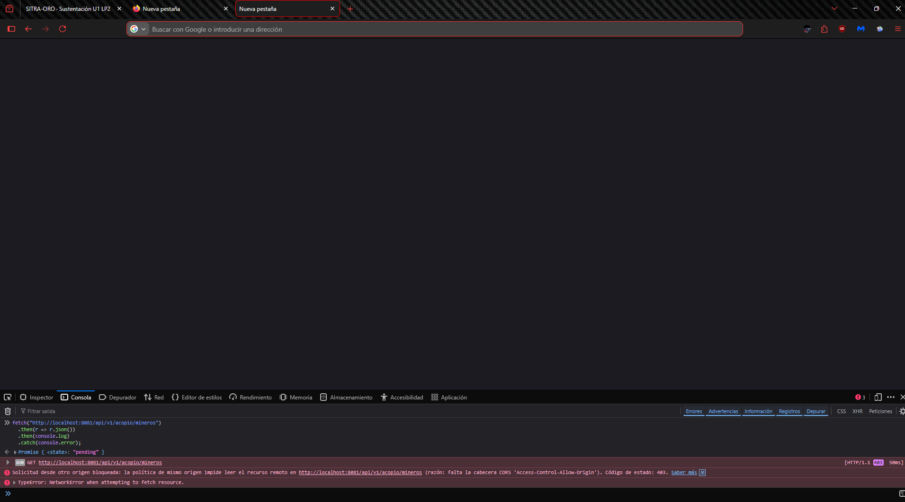
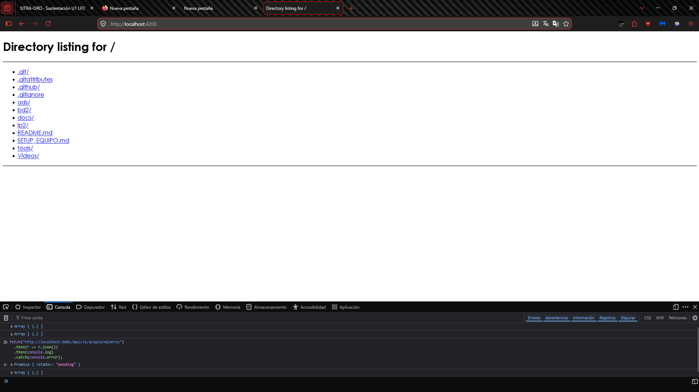

# INFORME DE EVIDENCIA DE APRENDIZAJE

## S05 Consultas Empresariales, Reportes REST y CORS

### SITRA-ORO

*Sistema de Información, Trazabilidad y Liquidación en Acopio de Oro*

**Universidad Peruana Unión (UPeU)** — Escuela Profesional de Ingeniería de Sistemas

---

## 1. Datos del estudiante

| Campo | Valor |
|---|---|
| **Nombre** | Faijo Calisaya Helio Paul |
| **Equipo** | Equipo 05 |
| **Sesión** | S05 - Consultas Empresariales, Reportes REST y CORS |
| **Rol o aporte** | Implementación y documentación de filtros, ordenamiento, proyección DTO, reporte agregado y CORS. |
| **GitHub** | https://github.com/helionelio900-hub/SysProyec_Acopus |

## 2. Propósito

Esta actividad demuestra la implementación individual de consultas empresariales en el dominio de liquidaciones mayoristas de SITRA-ORO. La solución combina filtros opcionales, ordenamiento seguro, una proyección resumida, agregados que responden cero cuando no existen datos y una política CORS configurable.

En todas las capturas debe verse la ventana completa, el reloj con fecha y hora y el usuario o perfil. Las fechas deben ser coherentes con el historial de commits del repositorio.

---

## 3. Evidencia técnica

### 3.1 Filtros combinados y ordenamiento

`GET /api/v1/mayorista/liquidaciones` recibe los filtros opcionales `estado`, `desde` y `hasta`. Los parámetros `ordenarPor` y `direccion` permiten cambiar el orden, y el servicio valida que solo se soliciten campos permitidos y las direcciones `ASC` o `DESC`.

```sql
SELECT l FROM LiquidacionG1 l
WHERE (:estado IS NULL OR l.estado = :estado)
  AND (:desde IS NULL OR l.fechaLiquidacion >= :desde)
  AND (:hasta IS NULL OR l.fechaLiquidacion <= :hasta)
```

#### Captura 1. Filtro por estado

*Ejecutar `estado=REGISTRADA` y dejar visibles la URL, la respuesta, el reloj y el perfil.*



**Explicación.** La respuesta contiene solo liquidaciones registradas y comprueba que el filtro por estado funciona de manera independiente.

#### Captura 2. Filtro por rango de fechas

*Ejecutar con `desde` y `hasta`, usando un intervalo que contenga datos.*



**Explicación.** La consulta limita los registros por `fechaLiquidacion`. La evidencia debe mostrar resultados dentro del intervalo solicitado.

#### Captura 3. Filtros combinados

*Ejecutar `estado=REGISTRADA` junto con `desde` y `hasta`.*



**Explicación.** La misma consulta aplica simultáneamente el estado y el intervalo de fechas; por eso los filtros son combinables.

#### Captura 4. Cambio de orden

*Repetir una consulta cambiando `direccion` de `DESC` a `ASC` sobre `fechaLiquidacion`.*



**Explicación.** El cambio visible en la secuencia de resultados confirma que el ordenamiento es configurable.

### 3.2 Proyección de resumen

`LiquidacionResumen` es un DTO distinto de la entidad completa. Transporta el identificador, fecha, estado, total pagado y cantidad de detalles para responder de forma ligera a un reporte.

```java
public record LiquidacionResumen(
    Long idLiquidacionG1, LocalDateTime fechaLiquidacion,
    EstadoLiquidacion estado, BigDecimal totalPagadoG2Pen,
    int cantidadDetalles
) {}

SELECT new ...LiquidacionResumen(
 l.idLiquidacionG1, l.fechaLiquidacion, l.estado,
 l.totalPagadoG2Pen, SIZE(l.detalles))
```

#### Captura 5. DTO LiquidacionResumen

*Abrir `LiquidacionResumen.java` en VS Code y mostrar el record completo.*



**Explicación.** El DTO expone únicamente los datos necesarios para el reporte y evita devolver la entidad completa.

#### Captura 6. Expresión de constructor JPQL

*Abrir `LiquidacionG1Repository.java` y mostrar `SELECT new` junto con `buscarResumen(...)`.*



**Explicación.** La consulta construye `LiquidacionResumen` desde JPQL y obtiene `SIZE(l.detalles)` sin incluir las líneas completas.

### 3.3 Reporte agregado

`GET /api/v1/mayorista/liquidaciones/resumen` devuelve `totalLiquidaciones`, `montoTotal` y `ticketPromedio` junto con la lista resumida. El cálculo usa `BigDecimal` y cubre explícitamente el caso vacío con cero, no `null`.

```java
long total = liquidaciones.size();
BigDecimal montoTotal = liquidaciones.stream()
    .map(LiquidacionResumen::totalPagadoG2Pen)
    .reduce(BigDecimal.ZERO, BigDecimal::add);
BigDecimal ticketPromedio = total == 0 ? BigDecimal.ZERO
    : montoTotal.divide(BigDecimal.valueOf(total), 2, RoundingMode.HALF_UP);
```

#### Captura 7. Reporte con resultados

*Ejecutar `/liquidaciones/resumen` en un intervalo con registros.*



**Explicación.** El agregado muestra conteo, monto total y ticket promedio calculados a partir de las liquidaciones filtradas.

#### Captura 8. Reporte sin resultados

*Ejecutar `/liquidaciones/resumen` con un rango futuro o sin coincidencias.*



**Explicación.** La respuesta debe mostrar `totalLiquidaciones`, `montoTotal` y `ticketPromedio` con valor `0`, nunca `null`.

### 3.4 Configuración y prueba de CORS

`CorsConfig` aplica la política a `/api/**` y lee el origen permitido desde `sitraoro.cors.allowed-origin`. En desarrollo se permite `http://localhost:4200`. La prueba debe realizarse desde JavaScript en un navegador real, no desde Postman ni consola.

```java
@Value("${sitraoro.cors.allowed-origin:http://localhost:4200}")
private String allowedOrigin;

registry.addMapping("/api/**")
 .allowedOrigins(allowedOrigin)
 .allowedMethods("GET", "POST", "PUT", "PATCH", "DELETE")
 .allowedHeaders("*");
```

#### Captura 9. Origen no permitido bloqueado

*Desde un origen distinto a `http://localhost:4200`, ejecutar `fetch` y mostrar el error CORS en DevTools.*



**Explicación.** El navegador bloquea el acceso de JavaScript a la respuesta cuando el `Origin` no coincide con el autorizado por el backend.

#### Captura 10. Origen configurado permitido

*Desde `http://localhost:4200`, repetir `fetch` y mostrar una respuesta exitosa.*



**Explicación.** Cuando el `Origin` coincide con la configuración, el navegador permite que JavaScript lea la respuesta de la API.

---

## 4. Hallazgo técnico

**Ordenamiento dinámico sin validación**

`ordenarPor` llega como texto por la URL. Si se usara sin validar, una propiedad inexistente provocaría un error en la consulta. La solución mantiene `CAMPOS_ORDENABLES` y acepta solamente `ASC` o `DESC`, con lo que la API rechaza pedidos inválidos de forma controlada.

## 5. Reflexión técnica breve

CORS no protege la API frente a `curl` o Postman porque la regla la hace cumplir el navegador, no el servidor como autenticación. Un cliente HTTP externo puede enviar peticiones directas. CORS protege al usuario web: impide que JavaScript de un sitio no autorizado lea respuestas de otro origen utilizando la sesión del usuario. Por eso no reemplaza autenticación, autorización ni validación de permisos en el backend.

## 6. Conclusiones

- Los filtros opcionales permiten resolver varias combinaciones con una única consulta.
- La proyección reduce los datos transportados hacia el cliente.
- Los agregados vacíos devuelven cero y evitan valores null en el frontend.
- CORS debe configurarse por ambiente y comprobarse en un navegador real.

---

## Anexo: Feedback de la sesión S05

1. **¿Cuál es el aprendizaje más importante?**
   Aprendí a crear consultas con filtros opcionales, ordenamiento y una proyección de reporte más ligera que la entidad completa.

2. **¿Qué punto fue más confuso?**
   Al inicio, comprender por qué `AVG` en JPQL devuelve `Double` aunque los montos del dominio sean `BigDecimal`.

3. **¿Qué pregunta queda para la siguiente clase?**
   ¿Cuál es la mejor forma de paginar y exportar un reporte grande sin cargar todos los resultados en memoria?

4. **Nivel de comprensión**
   [X] ¡Entendido! - Lo domino y podría explicarlo.

5. **¿Cómo puedo ayudarte a comprender mejor?**
   Con un ejemplo que compare proyecciones por constructor, interfaces de proyección y consultas nativas.

6. **Participación y esfuerzo**
   [X] Muy Comprometido/a: Me esforcé al máximo.

7. **Satisfacción con la clase**
   9 / 10.
