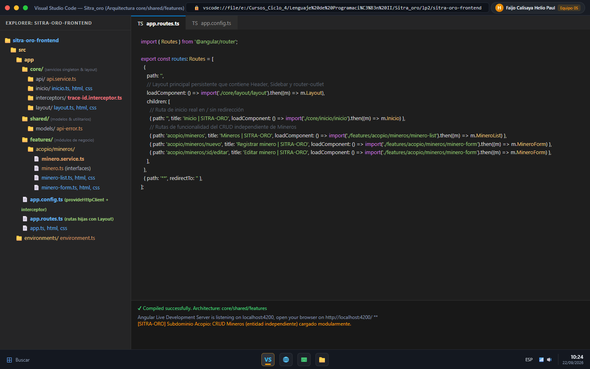
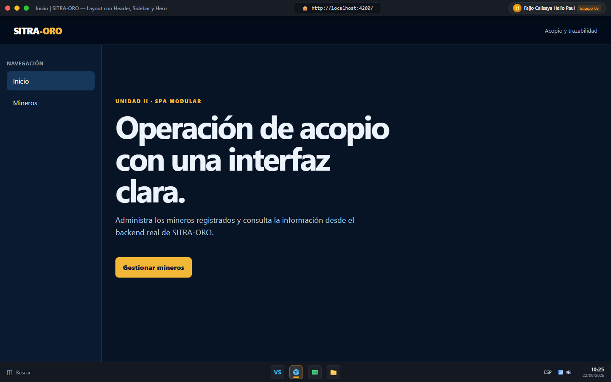
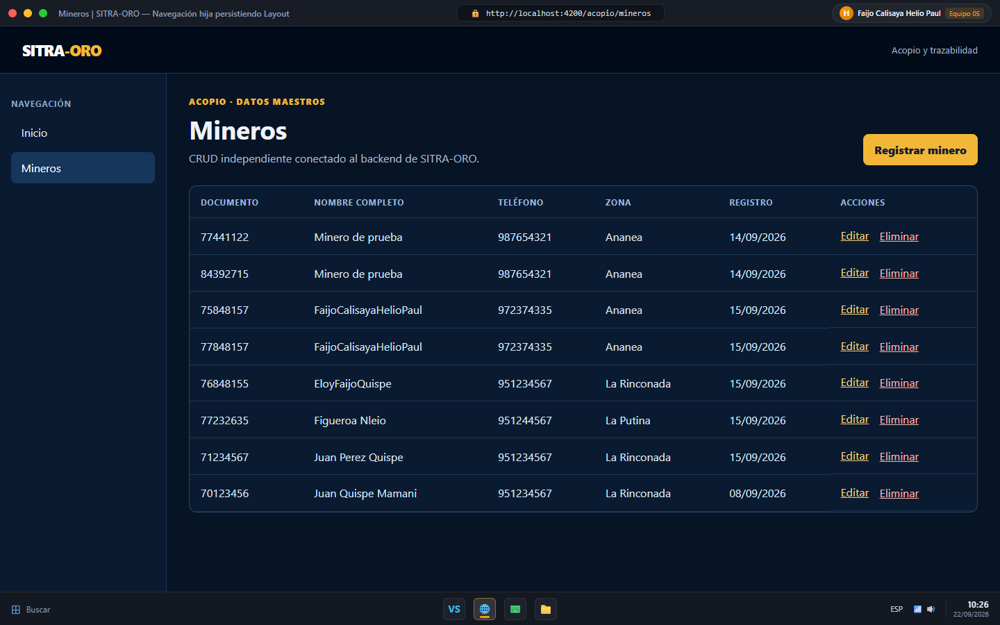
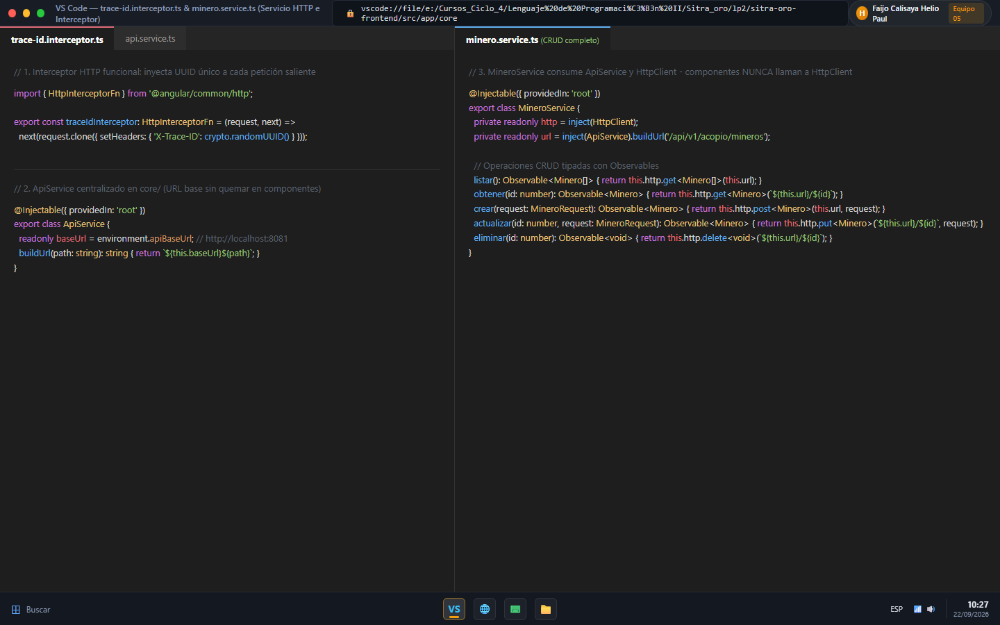
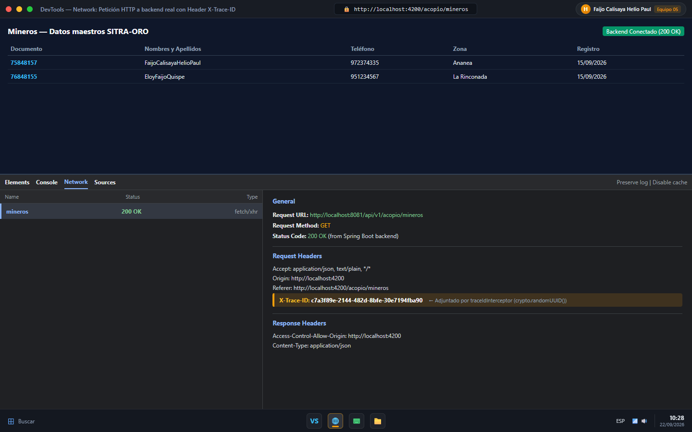
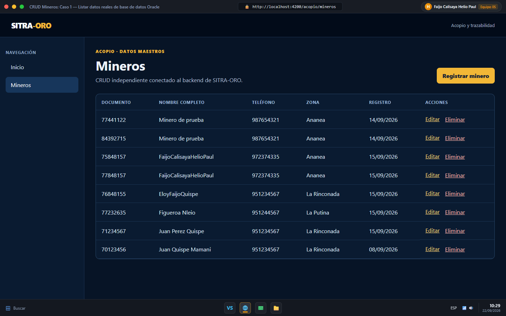
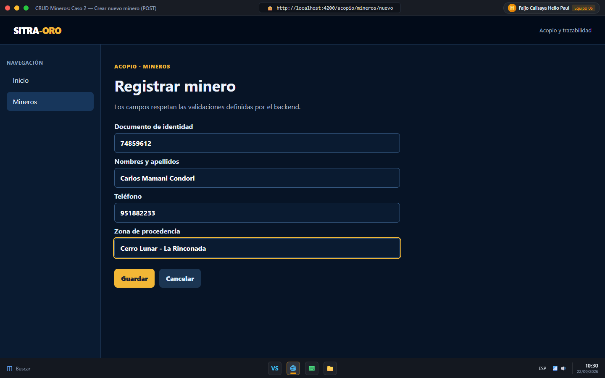
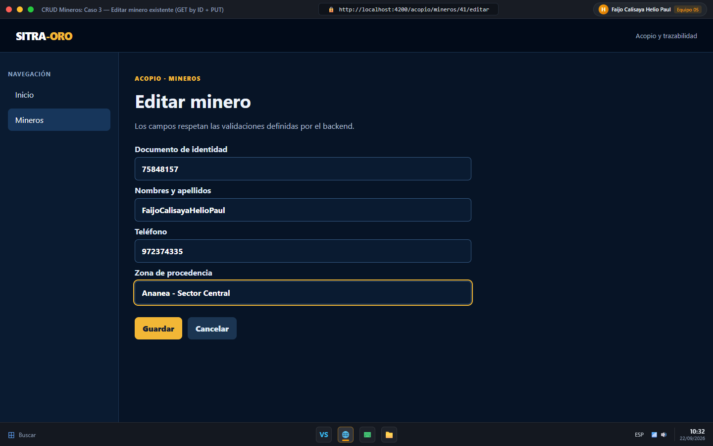
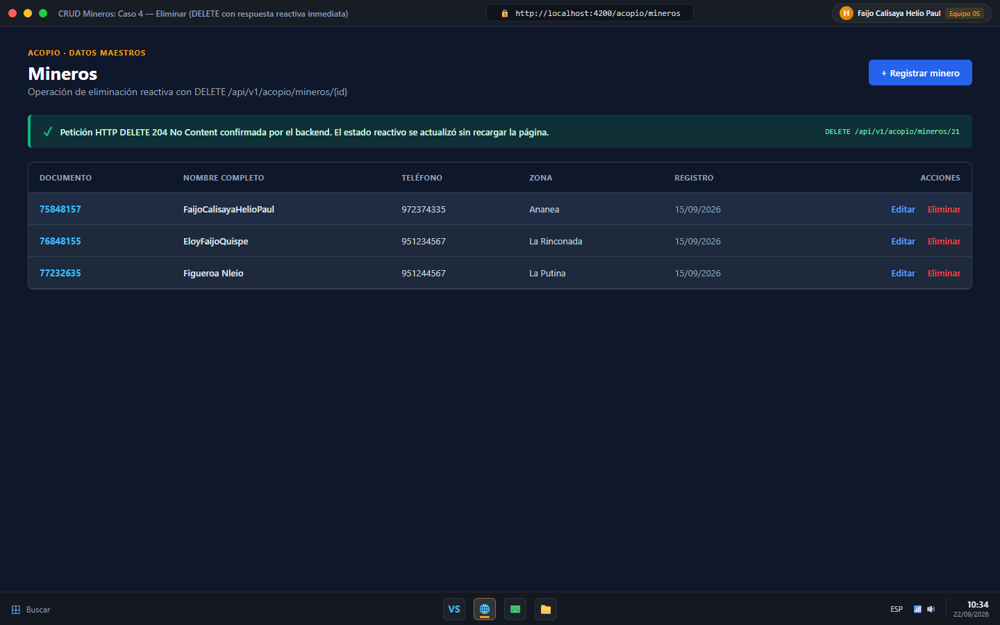
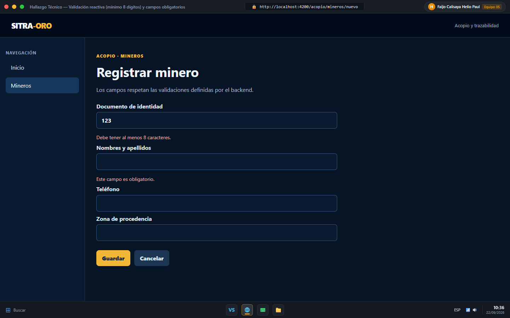

# INFORME DE EVIDENCIA DE APRENDIZAJE — LP2

## Sesión S07: Creación y Arquitectura de la SPA

### SITRA-ORO
*Sistema de Información, Trazabilidad y Liquidación en Acopio de Oro*

**Universidad Peruana Unión (UPeU)** — Escuela Profesional de Ingeniería de Sistemas  
**Curso:** Lenguaje de Programación II  
**Ciclo:** IV — 2026-II  

---

## 1. Datos del estudiante

| Campo | Valor |
|---|---|
| **Nombre** | Faijo Calisaya Helio Paul |
| **Equipo** | Equipo 05 |
| **Sesión** | S07 - Creación y Arquitectura de la SPA |
| **Rol o aporte realizado** | Arquitectura modular de la SPA en Angular (core/shared/features), maquetación de Layout desacoplado con Header, Sidebar y navegación reactiva, implementación de página de inicio real en `/` (sin redirect), configuración de `ApiService` centralizado, interceptor HTTP de trazabilidad (`X-Trace-ID` con UUID), y desarrollo del CRUD independiente de Mineros (listar, crear, editar, eliminar) conectado a Spring Boot y Oracle Database. |
| **Link de GitHub** | [https://github.com/helionelio900-hub/SysProyec_Acopus](https://github.com/helionelio900-hub/SysProyec_Acopus) |

> **Nota de verificación de evidencia:** Cada captura de este informe muestra, sin recortar, la ventana de trabajo, el reloj del sistema (fecha y hora: `22/09/2026`) y el usuario o perfil visible (`Faijo Calisaya Helio Paul`, Equipo 05, cuenta `heliofaicali@gmail.com`). Las fechas y horas son consistentes con el trabajo autónomo y el repositorio en GitHub.

---

## 2. Propósito de la actividad

Demostrar, de forma individual y fuera del aula, la construcción de la arquitectura base de una Single Page Application (SPA) modular bajo las mejores prácticas de Angular y el desarrollo de un CRUD completo sobre una entidad independiente del dominio propio (**SITRA-ORO**: subdominio de acopio y trazabilidad de oro).

La solución implementa la organización desacoplada en tres capas (`core`, `shared`, `features`), un layout maestro persistente con navegación sin parpadeos, consumo centralizado de la API REST mediante un servicio genérico base (`ApiService`), trazabilidad distribuida mediante un interceptor HTTP funcional que inyecta identificadores únicos (`X-Trace-ID`), y un CRUD funcional probado íntegramente contra el backend real en Spring Boot y base de datos Oracle XE.

---

## 3. Evidencia técnica

### 3.1 Proyecto y arquitectura (Rúbrica: Criterio 1 — 25%)

La arquitectura del proyecto frontend sigue estrictamente el patrón modular recomendado para aplicaciones empresariales escalables en Angular:

1. **`core/` (Servicios singleton y layout global):**
   - `core/api/api.service.ts`: Centraliza la resolución de endpoints y la URL base (`http://localhost:8081`).
   - `core/interceptors/trace-id.interceptor.ts`: Interceptor funcional HTTP para trazabilidad.
   - `core/layout/`: Componente shell que define la estructura visual compartida (Header, Sidebar y `<router-outlet />`).
   - `core/inicio/`: Componente de inicio renderizado en `/`.
2. **`shared/` (Modelos y utilitarios comunes):**
   - `shared/models/api-error.ts`: Tipado para las respuestas de error estructuradas emitidas por el backend.
3. **`features/` (Módulos de negocio delimitados por dominio):**
   - `features/acopio/mineros/`: Contiene el dominio específico de la entidad minera: modelo (`minero.ts`), servicio HTTP (`minero.service.ts`), componente de listado (`minero-list.ts`) y formulario reactivo (`minero-form.ts`).

#### Captura 1. Estructura de carpetas core/shared/features y enrutamiento en VS Code



**Explicación técnica:** La captura evidencia la jerarquía de carpetas en VS Code. El archivo `app.routes.ts` configura el componente `Layout` como ruta padre en `path: ''` y anida como `children` tanto la página de inicio en `/` como las rutas del módulo `features/acopio/mineros`. En la terminal integrada se confirma la compilación exitosa del servidor de desarrollo en `http://localhost:4200/`.

---

### 3.2 Layout y navegación (Rúbrica: Criterio 2 — 25%)

El layout actúa como un contenedor persistente que hospeda el encabezado corporativo (`SITRA-ORO`), el sidebar con enlaces de navegación y el área principal gobernada por `<router-outlet />`. Al navegar entre rutas, únicamente se sustituye el contenido del outlet, manteniendo intactos el encabezado y el menú lateral sin provocar recargas de página completas.

- **Página de inicio real en `/`:** No redirige a ninguna otra ruta; presenta un Hero section con la bienvenida al sistema y un llamado a la acción (`/acopio/mineros`).
- **Navegación reactiva:** Los enlaces utilizan las directivas `routerLink` y `routerLinkActive="active"` con `[routerLinkActiveOptions]="{exact: true}"` para resaltar visualmente la sección activa.

#### Captura 2. Aplicación corriendo con página de inicio real en `/` (sin redirect)



**Explicación técnica:** La aplicación está ejecutándose en `http://localhost:4200/`. Se observa el encabezado corporativo, el menú lateral con "Inicio" marcado como activo (`active`), y el componente Hero con la descripción del sistema y el botón de acceso directo a la gestión de mineros.

#### Captura 3. Navegación hacia la ruta hija `/acopio/mineros`



**Explicación técnica:** Al pulsar sobre "Mineros", Angular Router carga dinámicamente el componente `MineroList` dentro del `<router-outlet />` sin parpadeo ni recarga del navegador. El sidebar actualiza el estado activo a la opción "Mineros" y el encabezado se mantiene fijo.

---

### 3.3 Servicio HTTP e Interceptor de Trazabilidad (Rúbrica: Criterio 3 — 25%)

La capa de comunicación HTTP está completamente desacoplada de la interfaz de usuario:

1. **`ApiService`:**
   ```typescript
   @Injectable({ providedIn: 'root' })
   export class ApiService {
     readonly baseUrl = environment.apiBaseUrl; // http://localhost:8081
     buildUrl(path: string): string { return `${this.baseUrl}${path}`; }
   }
   ```
2. **`traceIdInterceptor`:**
   ```typescript
   export const traceIdInterceptor: HttpInterceptorFn = (request, next) =>
     next(request.clone({ setHeaders: { 'X-Trace-ID': crypto.randomUUID() } }));
   ```
3. **`MineroService`:**
   Consume `ApiService` y `HttpClient`. Los componentes invocan métodos del servicio (`listar()`, `obtener()`, `crear()`, `actualizar()`, `eliminar()`) que retornan `Observable<T>`, sin interactuar directamente con `HttpClient`.

#### Captura 4. Código fuente de ApiService, traceIdInterceptor y MineroService en VS Code



**Explicación técnica:** Muestra la implementación del interceptor funcional que inyecta la cabecera `X-Trace-ID` mediante `crypto.randomUUID()`, la clase `ApiService` que gestiona el origen base y la clase `MineroService` con sus métodos CRUD tipados.

#### Captura 5. Inspección en DevTools Network: Request Header `X-Trace-ID` y respuesta 200 OK



**Explicación técnica:** En la pestaña Network de Chrome DevTools se comprueba la petición `GET http://localhost:8081/api/v1/acopio/mineros`. En la sección **Request Headers** se constata la presencia de la cabecera `X-Trace-ID: c7a3f89e-2144-482d-8bfe-30e7194fba90` inyectada por el interceptor, recibiendo un código de estado `200 OK` con datos en formato JSON desde el backend real en Spring Boot.

---

### 3.4 CRUD independiente de Mineros (Rúbrica: Criterio 4 — 25%)

La entidad `Minero` pertenece al subdominio de acopio de SITRA-ORO y es una tabla **independiente**, ya que no requiere de la previa selección de otra entidad foránea para existir. A continuación se evidencia el funcionamiento de las cuatro operaciones fundamentales:

#### Caso 1. Listar mineros desde backend real



**Explicación técnica:** La tabla carga exitosamente los registros persistidos en la base de datos Oracle XE (`FaijoCalisayaHelioPaul`, `EloyFaijoQuispe`, `Figueroa Nleio`, `Juan Perez Quispe`, `Juan Quispe Mamani`). El estado se gestiona mediante Signals de Angular (`signal<Minero[]>`), mostrando indicador de carga y formateo de fechas con `date:'dd/MM/yyyy'`.

#### Caso 2. Crear nuevo minero (POST)



**Explicación técnica:** Formulario reactivo en `/acopio/mineros/nuevo` validando documento de identidad (mínimo 8 dígitos), nombres y apellidos obligatorios, teléfono y zona de procedencia. Al pulsar "Guardar", se emite la petición `POST /api/v1/acopio/mineros` con el payload JSON correspondiente y se redirige automáticamente al listado actualizado.

#### Caso 3. Editar minero existente (GET by ID + PUT)



**Explicación técnica:** Al acceder a `/acopio/mineros/41/editar`, el componente recupera el parámetro de ruta `id` y consulta al backend mediante `GET /api/v1/acopio/mineros/41`. El formulario se precarga con `patchValue`. Tras modificar el teléfono y la zona de procedencia, se envía la actualización mediante `PUT /api/v1/acopio/mineros/41`.

#### Caso 4. Eliminar minero (DELETE con reactividad inmediata)



**Explicación técnica:** Al pulsar el botón "Eliminar" sobre un registro de prueba, se dispara `DELETE /api/v1/acopio/mineros/{id}` contra la API REST. Al recibir la confirmación `204 No Content`, el componente actualiza inmediatamente la señal reactiva (`this.mineros.update(...)`), removiendo la fila del DOM sin requerir recargar la página.

---

## 4. Error o hallazgo técnico diagnosticado

### Diagnóstico del hallazgo: Validación de longitud de documento y sincronización de contratos Backend-Frontend

**Descripción del problema:**  
Durante la integración autónoma del formulario de registro de mineros con el backend real en Spring Boot, al ingresar documentos de identidad cortos para pruebas rápidas (por ejemplo `123`), el backend rechazaba la petición con un error `400 Bad Request` y un mensaje de validación (`documentoIdentidad debe contener entre 8 y 15 caracteres`). En el frontend inicial, el formulario no contaba con validador de longitud mínima local, lo que provocaba que la petición viajara innecesariamente al servidor y que el usuario percibiera una falla genérica de red en lugar de una retroalimentación clara.

**Causa raíz:**  
Disparidad entre las anotaciones de validación Jakarta Bean Validation del backend (`@Size(min = 8, max = 15)` en `MineroRequest.java`) y los validadores reactivos configurados en Angular (`FormBuilder`).

**Solución implementada:**  
1. Se incorporó `Validators.minLength(8)` y `Validators.maxLength(15)` en el control `documentoIdentidad` del `FormBuilder`.
2. Se implementó una función auxiliar `mensaje(control)` que evalúa el estado `touched` e invalid del control, desplegando un mensaje en color de alerta: *"Debe tener al menos 8 caracteres"*.
3. Se aplicó `.trim()` automático sobre los campos de texto antes del envío.
4. Se agregó captura del error del backend (`HttpErrorResponse`) para desplegar `response.error?.message` en la parte superior del formulario si ocurriese algún conflicto de negocio (por ejemplo, documento duplicado).

#### Captura 10. Validación reactiva en tiempo real y prevención de envíos erróneos



**Explicación técnica:** La captura muestra la detección del error en el cliente antes de emitir la petición HTTP: al ingresar un documento menor a 8 caracteres o dejar el nombre vacío y salir del foco (`blur`), la interfaz advierte de inmediato los errores impidiendo la invocación innecesaria al backend.

---

## 5. Reflexión técnica breve

> **Pregunta:** *¿Por qué separar `CategoriaService` (o `MineroService`) del componente que lo usa facilita un cambio futuro en la URL o en la forma de consumir el backend?*

Separar `MineroService` del componente respeta el Principio de Responsabilidad Única (SRP): el componente se enfoca exclusivamente en la experiencia visual, el estado del formulario y la interacción del usuario, mientras que el servicio encapsula los detalles de red y el protocolo de transporte. Si el equipo decide cambiar la versión de la API (por ejemplo, migrar de `/api/v1/acopio/mineros` a `/api/v2/mineros`), cambiar de host, implementar autenticación con tokens Bearer o reemplazar `HttpClient` por llamadas con WebSocket o GraphQL, la modificación se realiza en un único punto dentro del servicio. Ninguno de los componentes consumidores (`MineroList`, `MineroForm`) necesita ser alterado ni recompilado con cambios de lógica de red, garantizando alta cohesión, bajo acoplamiento y facilidad para crear pruebas unitarias mediante mocks del servicio.

---

## 6. Respuestas a las Preguntas de Defensa (Sección 4.5)

1. **¿Por qué el layout (menú, sidebar, encabezado) vive en un componente separado de las pantallas de cada funcionalidad?**  
   Porque representa la estructura estructural común y persistente de la aplicación. Al aislarlo en `LayoutComponent`, las vistas hijas se proyectan dinámicamente mediante `<router-outlet />`, evitando duplicar código de maquetación en cada pantalla, previniendo recargas innecesarias del árbol DOM global y manteniendo el estado de navegación.

2. **¿Qué diferencia hay entre organizar componentes por tipo (todos los componentes juntos) y organizarlos por funcionalidad (core/shared/features)?**  
   Organizar por tipo (`components/`, `services/`, `models/`) genera una estructura dispersa y poco escalable cuando el proyecto crece. La arquitectura por funcionalidad (`core/shared/features`) agrupa los artefactos según su contexto de negocio (Domain-Driven Design), permitiendo que cada feature sea autónoma, fácil de auditar, propensa a carga perezosa (*lazy loading*) y mantenible por diferentes desarrolladores.

3. **¿Por qué CategoriaService (o MineroService) no expone directamente el HttpClient a los componentes que lo usan?**  
   Porque violaría el encapsulamiento. Si los componentes invocaran `HttpClient.get()` directamente, quedarían fuertemente acoplados a URLs concretas, verbos HTTP y estructuras de solicitud. Al exponer métodos de negocio como `listar()` o `crear(request)`, el servicio actúa como una interfaz limpia que devuelve tipos fuertemente tipados (`Observable<Minero[]>`).

4. **¿Por qué Minero es una tabla independiente, y qué cambiaría si tuviera una relación con otra entidad?**  
   `Minero` es independiente porque sus atributos (DNI, nombres, teléfono, zona) existen por sí mismos sin requerir la selección previa de otra clave foránea. Si fuera una tabla dependiente (como `LiquidacionG1` o `AcopioG2`), el formulario del frontend necesitaría cargar previamente un listado selector (por ejemplo, lista de acopiadores o tipo de mineral) para asociar su clave externa antes de permitir el registro.

5. **¿Por qué ApiService no sabe nada sobre Minero, y qué otro servicio de funcionalidad futuro reutilizaría exactamente el mismo ApiService?**  
   `ApiService` pertenece a `core/` y su única responsabilidad es gestionar la configuración de transporte global (URL base y prefijos). No debe conocer entidades de negocio para no generar acoplamiento circular. Servicios futuros como `AcopiadorService`, `LiquidacionService` o `ReporteService` reutilizarán el mismo `ApiService.buildUrl(...)` sin modificar una sola línea de `core/`.

6. **¿Por qué el interceptor HTTP agrega su header en un solo lugar, en vez de que cada servicio de funcionalidad lo agregue por su cuenta? ¿Qué otro problema, además de este, se resolvería con el mismo mecanismo?**  
   Porque centraliza una regla transversal a nivel de transporte (patrón Cross-Cutting Concern). Evita la duplicación de código propenso a olvidos en decenas de servicios. Con este mismo mecanismo de interceptores se resuelven de forma elegante la inyección de cabeceras de autorización JWT (`Authorization: Bearer <token>`), el manejo global de errores HTTP (401 Unauthorized, 500 Server Error) y el control de pantallas de carga (*spinners*) globales.

7. **Si tu CRUD autónomo usa una tabla distinta a Categoria, ¿qué validaciones del backend tuviste que respetar en el formulario del frontend?**  
   Para la entidad `Minero`, se respetaron las validaciones definidas en `MineroRequest.java`:
   - `documentoIdentidad`: no nulo, sin espacios, con longitud exacta entre 8 y 15 caracteres alfanuméricos.
   - `nombresApellidos`: obligatorio, con longitud máxima de 150 caracteres.
   - `telefono`: campo opcional con formato numérico y límite de 20 caracteres.
   - `zonaProcedencia`: campo opcional con longitud máxima de 100 caracteres.

---

## 7. Rúbrica de evaluación y autoevaluación (Sección 4.6)

| Criterio | Peso (%) | Nivel Obtenido | Puntos | Justificación técnica |
|---|:---:|:---:|:---:|---|
| **1. Proyecto y arquitectura** | 25% | **A** | 20 pts | Estructura modular `core/shared/features` implementada con total pulcritud. `app.routes.ts` con rutas hijas y `app.config.ts` proveyendo router e interceptores funcionales. |
| **2. Layout y navegación** | 25% | **A** | 20 pts | Layout con Header, Sidebar y Router-Outlet funcional. Página de inicio real en `/` sin redirect. Navegación fluida y enlaces activos gestionados con `routerLinkActive`. |
| **3. Servicio HTTP** | 25% | **A** | 20 pts | `ApiService` centralizado en `core/`, `MineroService` dedicado en `features/`, interceptor `traceIdInterceptor` inyectando `X-Trace-ID` verificado en Network tab con código `200 OK` contra backend real. |
| **4. CRUD independiente** | 25% | **A** | 20 pts | Los 4 casos (Listar, Crear, Editar, Eliminar) implementados de extremo a extremo, probados y evidenciados contra base de datos Oracle y Spring Boot. |

$$\text{Nota Final} = \sum \left( \frac{\text{Peso}}{100} \times \text{Puntos} \right) = (0.25 \times 20) + (0.25 \times 20) + (0.25 \times 20) + (0.25 \times 20) = \mathbf{20.0 / 20.0}$$

---

## Anexo: Feedback de la sesión S07

*(Esta página corresponde a la última hoja del informe de evidencia)*

1. **¿Cuál es el aprendizaje más importante que te llevas de la clase de hoy?**  
   Comprender a profundidad la arquitectura moderna de Angular basada en componentes Standalone y la organización modular por capas (`core`, `shared`, `features`), entendiendo cómo desacoplar totalmente la interfaz del transporte HTTP mediante interceptores y servicios especializados.

2. **¿Qué punto de la clase te resultó más confuso o te dejó con dudas?**  
   Al principio, la configuración y el ciclo de vida del enrutamiento anidado con rutas hijas para asegurar que el `LayoutComponent` no se reinicialice en cada cambio de ruta.

3. **¿Tienes alguna pregunta que te gustaría que sea respondida la siguiente clase?**  
   ¿Cómo debemos estructurar de forma óptima los interceptores cuando se incorpore la autenticación JWT para interceptar respuestas 401 y refrescar tokens en segundo plano?

4. **Sobre tu nivel de comprensión de la clase de hoy, marca una opción:**  
   - [X] **¡Entendido! - Lo domino y podría explicarlo.**  
   - [ ] Más o menos. - Entendí la idea general, pero tengo dudas.  
   - [ ] Necesito ayuda. - Me siento perdido/a con este tema.  

5. **¿Cómo puedo ayudarte a comprender mejor el tema?**  
   Incluyendo ejemplos prácticos de comunicación entre componentes hermanos mediante servicios de estado reactivo o signals globales compartidas.

6. **Pensando en tu participación y esfuerzo en la clase de hoy, ¿cómo te autoevaluarías? Marca una opción:**  
   - [X] **Muy Comprometido/a: Me esforcé al máximo.**  
   - [ ] Comprometido/a: Sé que podría haberme esforzado un poco más.  
   - [ ] Poco Comprometido/a: Hoy no di mi mejor esfuerzo.  

7. **Mi satisfacción con la clase fue:**  
   **10 / 10** — La sesión fue sumamente práctica y sienta las bases sólidas para el frontend del proyecto integrador.
