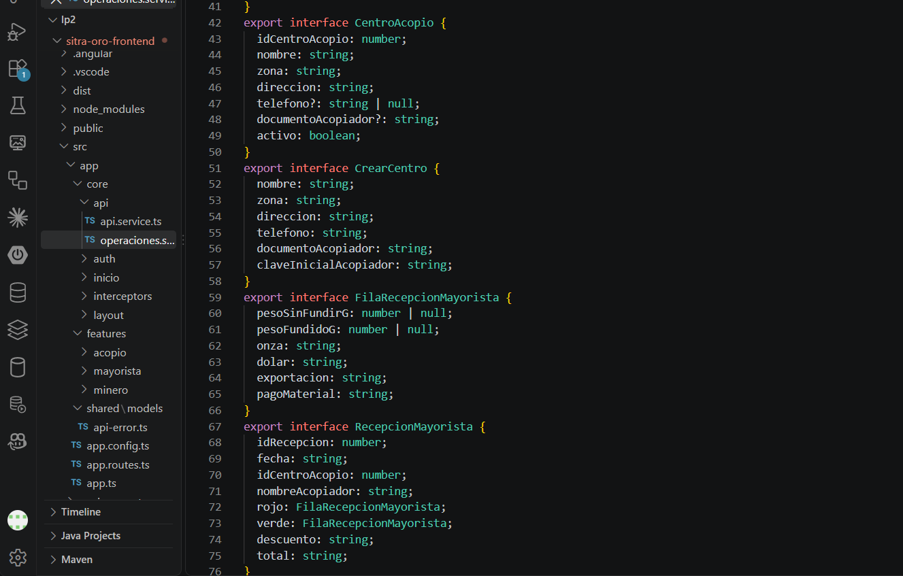
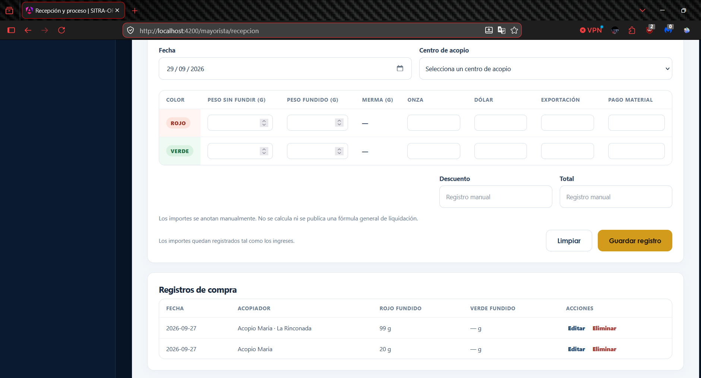
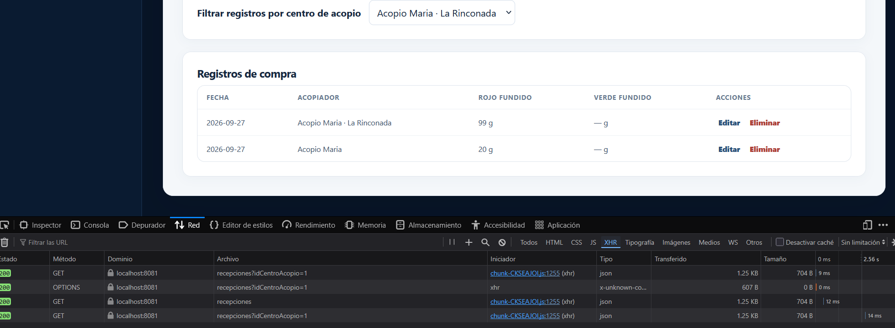
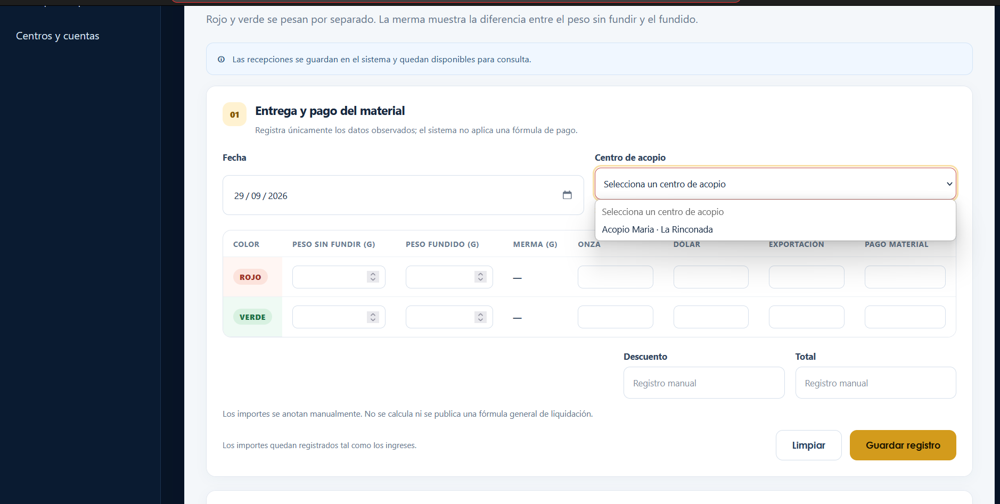
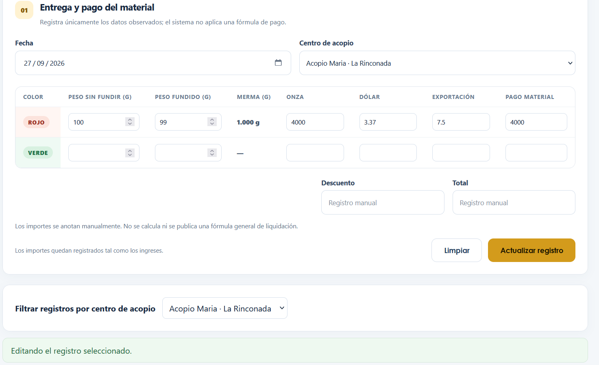
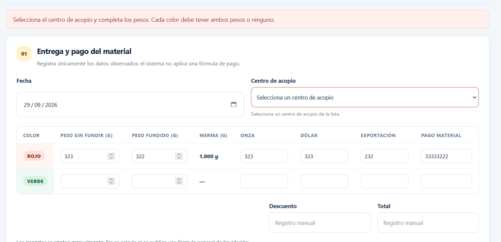
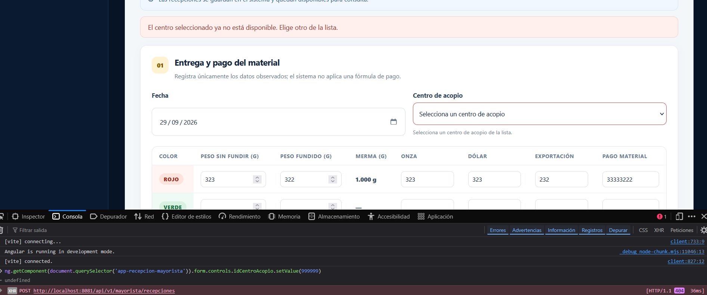
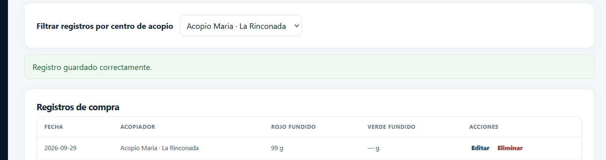
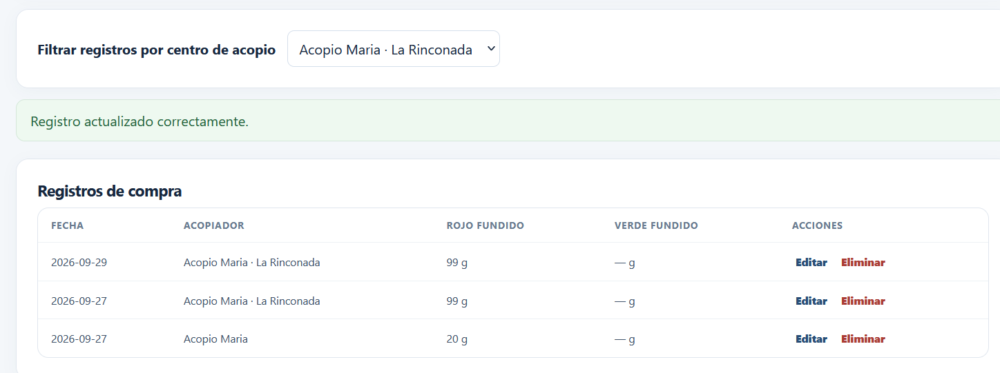
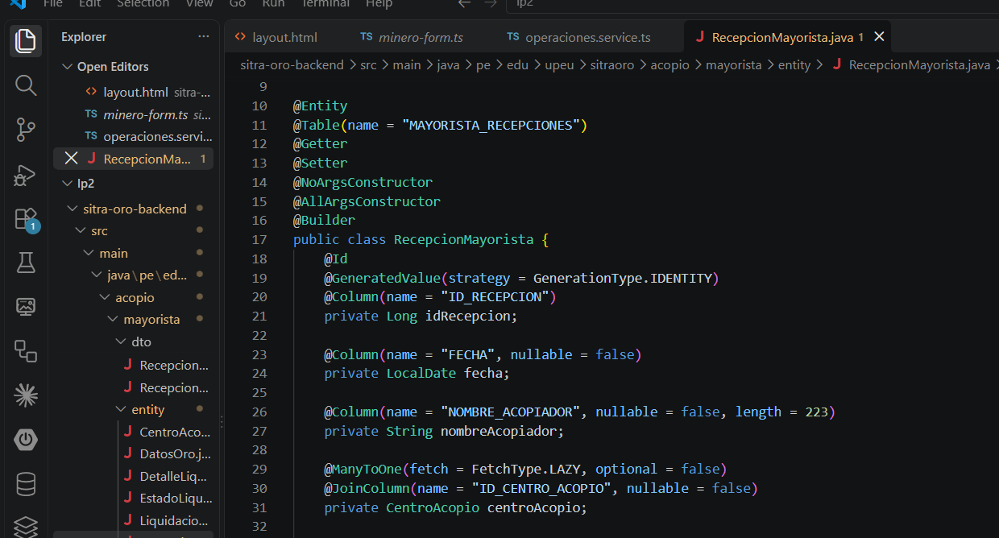

# Informe de evidencia de aprendizaje — S08

## CRUD de tablas dependientes en SITRA-ORO

**Universidad Peruana Unión** · Escuela Profesional de Ingeniería de Sistemas  
**Asignatura:** Lenguaje de Programación II · Ciclo IV · 2026-II  
**Estudiante:** Faijo Calisaya Helio Paul  
**Equipo:** 05  
**Módulo:** Mayorista — recepción asociada a centro de acopio  
**Repositorio del proyecto:** [SITRA-ORO](https://github.com/helionelio900-hub/SysProyec_Acopus)

> Este informe conserva la evidencia de S08 registrada en el [PDF original](S08_LP2_Equipo05_FaijoCalisayaHelioPaul.pdf). Las diez capturas están incluidas abajo para que GitHub las muestre junto con sus explicaciones. El informe describe el estado observado durante esa actividad; el proyecto puede haber recibido cambios posteriores.

## 1. Propósito

Implementar y documentar un CRUD dependiente en el dominio de SITRA-ORO. La entidad hija es **Recepción Mayorista** y la entidad padre es **Centro de Acopio**. El formulario envía el identificador del centro; el backend valida la relación y la respuesta devuelve una etiqueta legible para el listado.

```text
Centro de Acopio (padre)
        │ idCentroAcopio
        ▼
Recepción Mayorista (hija)
        │
        ├─ formulario y servicio HTTP de Angular
        ├─ controlador y servicio de Spring Boot
        └─ clave foránea en Oracle
```

## 2. Modelo y comunicación HTTP

| Pieza | Datos relevantes | Función |
|---|---|---|
| Centro de Acopio | `idCentroAcopio`, nombre, zona, estado activo | Ofrece las opciones válidas del selector. |
| Solicitud de recepción | Fecha, `idCentroAcopio`, pesos rojo y verde, importes registrados | Envía al servidor la identidad del centro elegido. |
| Respuesta de recepción | `idRecepcion`, `idCentroAcopio`, nombre del acopiador y datos registrados | Permite consultar y editar sin perder la relación. |
| Persistencia | Referencia de la recepción al centro y clave foránea | Protege la asociación entre registros. |

El [servicio HTTP del frontend](../lp2/sitra-oro-frontend/src/app/core/api/operaciones.service.ts) concentra las llamadas. El componente de la pantalla consume ese servicio; el backend obtiene el centro por ID y comprueba que exista y esté activo antes de guardar la recepción.

### Captura 1. Modelos de entrada y salida



**Explicación.** En el código se distinguen los datos del centro y los de la recepción. La solicitud utiliza `idCentroAcopio` como valor numérico para guardar la relación. La respuesta conserva ese ID e incorpora el nombre asociado para mostrarlo en la interfaz. El usuario selecciona un nombre, mientras el sistema persiste una referencia verificable.

## 3. Listado y filtro por centro

La lista muestra el centro relacionado con cada recepción. El filtro envía `idCentroAcopio` al backend, que devuelve solo los registros correspondientes cuando se elige un centro.

### Captura 2. Listado con información relacionada



**Explicación.** Cada fila presenta la fecha, los pesos fundidos y el nombre del acopiador relacionado que devuelve el backend. Esta presentación permite reconocer el origen de la recepción sin interpretar un identificador aislado. Las acciones **Editar** y **Eliminar** corresponden al registro de esa fila.

### Captura 3. Petición real del filtro



**Explicación.** Con «Acopio Maria · La Rinconada» seleccionado, la pestaña **Red** muestra `GET recepciones?idCentroAcopio=1` y respuesta `200`. El parámetro confirma que el frontend envía al servidor el ID del centro elegido; el filtro no depende únicamente de ocultar filas en el navegador.

## 4. Selector y edición

El formulario carga los centros disponibles desde el backend. Muestra nombre y zona, y usa el identificador numérico como valor del selector. Al editar, recupera `registro.idCentroAcopio` y presenta preseleccionada la opción correspondiente.

### Captura 4. Selector de centros disponibles



**Explicación.** El selector abierto ofrece «Acopio Maria · La Rinconada» como centro disponible. La persona elige una etiqueta comprensible; el formulario conserva el ID del centro para asociarlo a la recepción al guardar. No se solicita escribir el ID manualmente.

### Captura 5. Centro preseleccionado al editar



**Explicación.** El formulario recupera una recepción existente, precarga sus valores y deja seleccionado «Acopio Maria · La Rinconada». El botón **Actualizar registro** y el aviso «Editando el registro seleccionado» indican que se modificará ese registro, conservando su relación con el centro.

## 5. Validación de la dependencia

La relación se controla en tres puntos: el formulario exige una opción válida, el backend comprueba que el centro exista y permanezca activo, y la base de datos mantiene la clave foránea. El frontend puede avisar pronto, mientras el backend y Oracle protegen las peticiones enviadas por cualquier cliente.

### Captura 6. Intento de guardar sin centro



**Explicación.** Aunque se ingresaron pesos para el oro rojo, el campo **Centro de acopio** continúa sin selección y aparece un aviso de validación. La operación se detiene antes de crear una recepción sin la relación obligatoria con su centro.

### Captura 7. Rechazo de un centro inexistente



**Explicación.** La consola muestra una petición `POST /api/v1/mayorista/recepciones` rechazada con `404` tras enviar un ID de centro inexistente. La pantalla explica que el centro seleccionado ya no está disponible y pide elegir otro. Este caso muestra la validación del backend incluso cuando se fuerza una petición fuera del recorrido normal del selector.

## 6. CRUD conectado al backend

| Acción | Petición | Resultado visible |
|---|---|---|
| Listar | `GET /api/v1/mayorista/recepciones` | Filas recuperadas del servidor. |
| Crear | `POST /api/v1/mayorista/recepciones` | Confirmación y nueva fila. |
| Editar | `PUT /api/v1/mayorista/recepciones/{id}` | Valores actualizados en el listado. |
| Eliminar | `DELETE /api/v1/mayorista/recepciones/{id}` | Retiro de la fila tras la respuesta del servidor. |

### Captura 8. Creación de una recepción



**Explicación.** La pantalla confirma que el registro se guardó y muestra una fila nueva bajo el centro seleccionado. La coincidencia entre el mensaje y el listado permite observar el resultado de la creación, no solo el llenado del formulario.

### Captura 9. Actualización de una recepción



**Explicación.** Tras editar y guardar, la aplicación muestra «Registro actualizado correctamente» y vuelve al formulario de nuevo registro. El listado conserva la recepción asociada al centro. Los enlaces **Eliminar** visibles en la tabla muestran la acción disponible; esta imagen documenta la **actualización**, no una eliminación ejecutada.

## 7. Hallazgo técnico y corrección

Las recepciones históricas guardaban el nombre del acopiador como texto, sin una referencia estructural al Centro de Acopio. Ese texto podía quedar desactualizado y no permitía comprobar la relación. La migración incorporó `ID_CENTRO_ACOPIO` y vinculó los registros históricos cuya correspondencia era inequívoca. Según la verificación documentada en el PDF, las dos recepciones antiguas quedaron asociadas y ninguna permaneció sin centro.

### Captura 10. Relación incorporada a los datos históricos



**Explicación.** La captura muestra el resultado de la corrección del modelo: las recepciones se identifican mediante `ID_CENTRO_ACOPIO` y dejan de depender únicamente del nombre escrito como texto. La clave foránea mantiene verificable el vínculo entre cada recepción y su centro.

## 8. Reflexión técnica

Validar en el formulario permite avisar antes de enviar datos incompletos. Validar de nuevo en el backend protege las peticiones hechas desde otros clientes y detecta centros que hayan dejado de estar disponibles. La clave foránea agrega integridad en Oracle. La misma relación queda así representada de forma coherente en la pantalla, la API y la base de datos.

## Anexo. Feedback de la sesión

**1. ¿Cuál es el aprendizaje más importante que te llevas de la clase de hoy?**  
Aprendí que una tabla dependiente debe enviar el ID de la tabla padre y que la respuesta puede incluir su nombre para mostrar la relación.

**2. ¿Qué punto de la clase te resultó más confuso o te dejó con dudas?**  
Al inicio me costó diferenciar el ID que se guarda y el nombre que se muestra; todavía tenía dudas sobre el filtro que se envía al backend.

**3. ¿Tienes alguna pregunta que te gustaría que sea respondida la siguiente clase?**  
¿Cómo se implementa el filtro por tabla padre para que el backend reciba el parámetro y devuelva solo las filas relacionadas?

**4. Nivel de comprensión de la clase:**  
☐ ¡Entendido! · ☒ Más o menos, entendí la idea general pero tengo dudas · ☐ Necesito ayuda.

**5. ¿Cómo puedo ayudarte a comprender mejor el tema?**  
Con un ejemplo paso a paso que conecte formulario, modelos, servicio HTTP, endpoint, repositorio y respuesta.

**6. Participación y esfuerzo:**  
☐ Muy comprometido/a · ☒ Comprometido/a · ☐ Poco comprometido/a.

**7. Satisfacción con la clase (del 1 al 10):**  
Calificación pendiente de marcar: 1 · 2 · 3 · 4 · 5 · 6 · 7 · 8 · 9 · 10.
