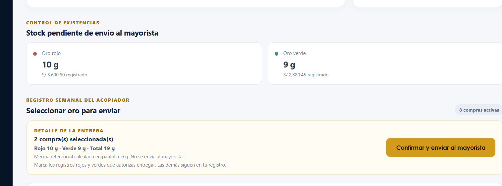
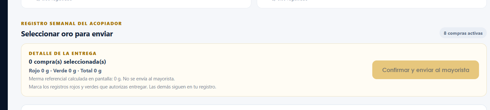
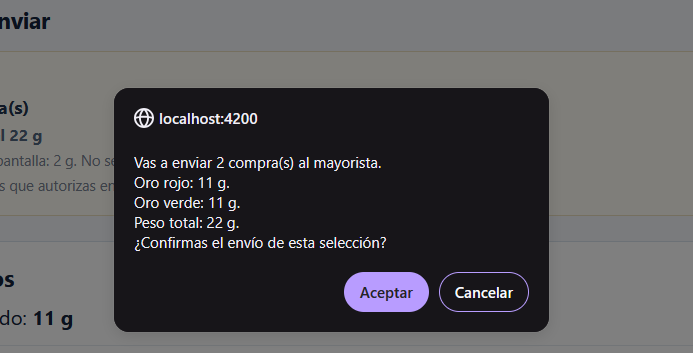
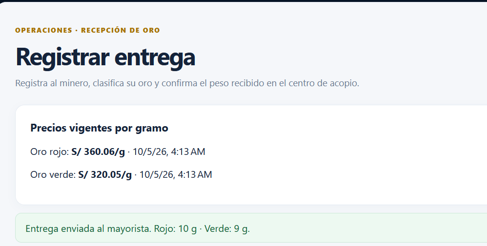
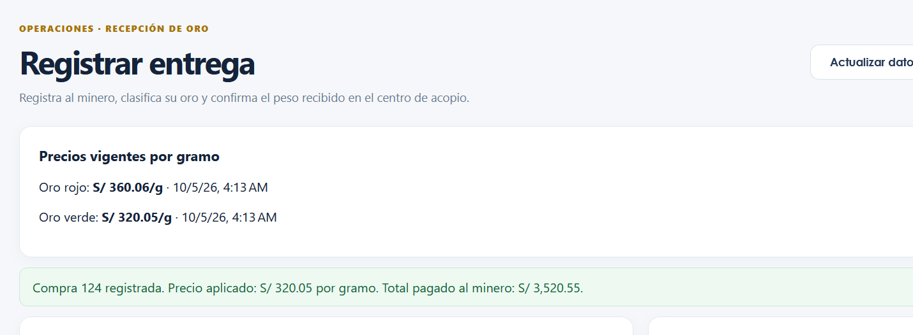
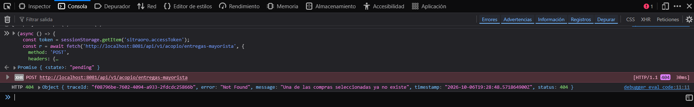
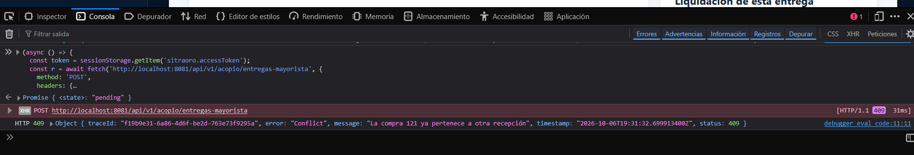
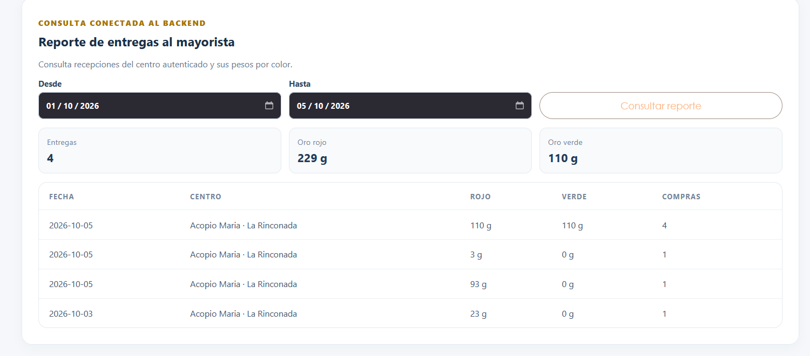

# Informe de evidencia de aprendizaje — S09

## Formularios transaccionales cabecera-detalle en SITRA-ORO

**Universidad Peruana Unión** · Escuela Profesional de Ingeniería de Sistemas  
**Asignatura:** Lenguaje de Programación II · Ciclo IV · 2026-II  
**Estudiante:** Faijo Calisaya Helio Paul  
**Equipo:** 05 · SITRA-ORO  
**Sesión:** S09 — Formularios Transaccionales Cabecera-Detalle  
**Rol o aporte:** Flujo del acopiador: selección de compras, envío al mayorista y consulta de entregas  
**Repositorio:** [SITRA-ORO](https://github.com/helionelio900-hub/SysProyec_Acopus)

> Este archivo es el informe en Markdown que renderiza el repositorio. El PDF solicitado por la actividad lo prepararé manualmente. Las capturas quedan pendientes y deben ser tomadas por el estudiante durante una ejecución real; no se presentan imágenes ficticias.

> **Estado del borrador:** contenido técnico en revisión. Ya se incorporó evidencia real de selección, cálculos, validación de colección, diálogo previo, respuestas API 404/409, resultado exitoso del envío y reporte filtrado (capturas parciales); faltan capturas completas con reloj y perfil visibles, la reflexión personal y el feedback del aula antes de exportar y entregar el PDF.

## 1. Operación elegida y modelos

La operación elegida es **enviar al mayorista una selección de compras ya registradas por el acopiador**. El acopiador decide qué compras entrega; cada compra conserva su minero, color y pesos. El backend crea una recepción como cabecera y vincula las compras escogidas como líneas del detalle. Las compras que no se seleccionan siguen en el registro del acopiador.

### DTO de solicitud real

El formulario no manda precios ni subtotales. Envía los identificadores de las compras que el acopiador decidió entregar:

```json
{
  "idsComprasAcopiador": [101, 104]
}
```

En Java, el modelo de entrada es `EntregaMayoristaRequest`: una lista de entre 1 y 200 identificadores positivos, sin valores nulos. El servicio verifica duplicados, pertenencia al centro autenticado, vigencia y disponibilidad antes de vincular las compras.

### DTO de respuesta real

La respuesta `RecepcionMayoristaResponse` contiene el identificador y fecha de la recepción, el centro, acumulados separados de oro rojo y verde, y `idsComprasAcopiador`. Las compras existentes funcionan como líneas vinculadas; no se duplican sus registros ni se modifica el precio que el acopiador pagó al minero. La recepción devuelve el peso fundido neto por color; el peso sin fundir y los datos personales del minero no se copian al mayorista.

### Relación cabecera-detalle

| Elemento | Modelo en SITRA-ORO | Responsabilidad |
|---|---|---|
| Cabecera persistida | `RecepcionMayorista` | Identifica fecha y centro, y conserva los pesos agregados por color. |
| Líneas variables del formulario | `FormArray` de IDs de compra | Mantiene la selección actual; marcar una compra agrega su ID y desmarcarla lo quita. Los IDs no se duplican. |
| Detalle persistido | `TransaccionG2` existentes | Cada compra seleccionada queda vinculada a la cabecera por `idRecepcionMayorista`. |
| DTO de entrada | `EntregaMayoristaRequest` | Envía `idsComprasAcopiador`; el servidor valida y calcula los pesos. |
| DTO de salida | `RecepcionMayoristaResponse` | Devuelve la cabecera, los acumulados por color y los IDs vinculados. |

La tabla presenta casillas separadas por color. Al marcar o desmarcar una compra, el componente agrega o quita su ID del `FormArray`; ese arreglo mantiene la selección que se enviará. El peso total por color y la merma referencial se calculan en la pantalla; no se envían como valores confiables. El backend vuelve a consultar las compras y copia el peso fundido del acopiador como peso sin fundir recibido por el mayorista. El peso original del minero permanece en la compra del acopiador.

**Nota de ajuste a la rúbrica:** la selección sí es dinámica y usa un `FormArray`, pero la interfaz actual la controla con casillas y no muestra botones visibles “Agregar línea” y “Quitar línea”. Si el docente exige literalmente esos botones, falta adaptar la interfaz antes de tomar la captura del bloque 1. No presentar las casillas como botones.

## 2. Evidencia técnica

### Estado frente a los criterios de S09

| Criterio | Estado actual | Qué falta para cerrar |
|---|---|---|
| FormArray dinámico con mínimo una compra | Implementado y sincronizado con casillas | Confirmar si el docente exige botones visibles Agregar/Quitar; la UI actual no los muestra. |
| Derivados por línea y total con `computed` | Evidencia real parcial: 10 g rojo + 9 g verde = 19 g; merma referencial 6 g | Completar captura de pantalla completa con hora y perfil visibles. |
| Validación de colección y campos | Captura real muestra 0 compras y botón de envío deshabilitado | Falta evidencia completa con reloj y perfil; no se ha capturado la validación de IDs vacíos/duplicados. |
| Confirmación y dos errores distintos | Diálogo previo y respuestas API 404/409 capturados | Si la rúbrica lo exige, capturar también los mensajes visibles de la interfaz para cada error. |
| Consulta de agregados con filtro | Captura real: 01/10/2026–05/10/2026, 4 entregas, 229 g rojos y 110 g verdes | Completar captura de pantalla completa con reloj y perfil visibles. |
| PDF y requisitos de evidencia | Evidencia real parcial incorporada | Completar capturas de los demás criterios y una captura completa con hora y perfil; luego exportar el PDF con el nombre pedido. |

Cada imagen debe ser una captura completa de la pantalla, sin recortar, con el reloj del sistema (fecha y hora) y el usuario o perfil visible. Guarda los archivos con estos nombres en `docs/img_S09_FaijoCalisayaHelioPaul/`. Después de agregarlos, los enlaces siguientes renderizarán las capturas aquí y en el PDF que prepares.

### Bloque 1 — Formulario con detalle dinámico

**Archivo:** `captura-01-formarray.png`


**Evidencia real recibida — resumen de selección.** En el momento de esa captura estaban seleccionadas 2 compras: registro rojo #121 (10 g) y registro verde #122 (9 g), para un total de 19 g. La merma referencial mostrada era 6 g y no se envía al mayorista. Una captura posterior confirma que el usuario completó el envío de esas cantidades.


Esta imagen solo muestra el resumen de selección, no la pantalla completa ni el reloj y el perfil del sistema. Se conserva como evidencia complementaria; falta tomar la captura completa solicitada por la rúbrica.

**Explicación.** El acopiador marca cada compra que autoriza enviar desde las tablas separadas de oro rojo y verde. Cada fila muestra ID, color, peso fundido y minero. Marcar agrega el ID al `FormArray`; desmarcarlo lo quita. La colección exige al menos una compra y no admite IDs duplicados.

**Qué mostrar:** compras marcadas en rojo y/o verde, sumas por color y la selección dinámica. La interfaz actual no muestra botones visibles para agregar/quitar líneas; si se adapta a la rúbrica, actualiza esta captura con esos controles. Reloj del sistema y usuario/perfil visibles.

### Bloque 2 — Cálculos y validación

**Archivo:** `captura-02-calculos.png`



**Explicación.** Al seleccionar una compra, la pantalla del acopiador muestra el subtotal de peso fundido y calcula la merma referencial como peso sin fundir menos peso fundido. Un `computed` suma las mermas y los pesos fundidos rojos y verdes para obtener el total de la entrega. La merma queda solo en el acopiador; el backend vuelve a leer las compras y guarda en la recepción mayorista solo el peso fundido neto por color.

**Evidencia real recibida.** Con una compra roja de 10 g y una verde de 9 g seleccionadas, la pantalla muestra 19 g en total y 6 g de merma referencial. La merma queda en pantalla y no se envía al mayorista. La captura recibida es parcial; falta una captura completa con reloj y perfil visibles. En la revisión actual del navegador la selección aparece en cero, por lo que esta imagen documenta el estado anterior y no confirma que siga seleccionado.

**Archivo:** `captura-03-validacion.png`



**Evidencia real recibida.** Con cero compras seleccionadas, la pantalla muestra 0 g por color y total, y deshabilita “Confirmar y enviar al mayorista”; así impide enviar una colección vacía. Esta captura es parcial y no incluye reloj ni perfil. No demuestra por sí sola la validación de IDs vacíos, duplicados ni el límite de 200 compras.

### Bloque 3 — Confirmación y manejo de errores

**Archivos:** `captura-04-confirmacion.png`, `captura-05-error-404.png` y `captura-06-error-409.png`



**Evidencia real recibida.** El diálogo del navegador muestra 2 compras, 11 g de oro rojo, 11 g de oro verde y 22 g en total, y solicita confirmar antes de enviar. Esta selección corresponde a esta captura y es distinta de la selección anterior de 10 g rojos + 9 g verdes cuyo resultado exitoso se documenta debajo. La imagen no incluye reloj ni perfil del sistema.

**Explicación.** Antes del POST, el diálogo muestra cantidad de compras, gramos rojos, verdes y total. Si se cancela, no se envía la solicitud; si se confirma, el frontend manda únicamente la lista de IDs. Así el acopiador puede revisar la selección antes de crear la recepción.

**Resultado real del envío:** la captura posterior muestra el aviso verde “Entrega enviada al mayorista” con rojo 10 g y verde 9 g. Esto documenta que la operación sí se confirmó.



**Evidencia complementaria — registro de compra #124.** La segunda imagen recibida documenta otro evento: el sistema informa que registró la compra 124, con precio aplicado de S/ 320.05 por gramo y total pagado de S/ 3,520.55. Se mantiene separada del diálogo de envío al mayorista.





**Evidencia real recibida.** Se envió al endpoint `POST /api/v1/acopio/entregas-mayorista` un ID positivo inexistente. El backend respondió HTTP 404 con el mensaje “Una de las compras seleccionadas ya no existe”. La prueba usa un ID ficticio y no edita compras reales; la excepción dentro de la operación transaccional hace que se revierta la recepción iniciada.

**Alcance de esta captura.** Muestra la respuesta del backend en la Consola de herramientas de desarrollo. No muestra un aviso emergente de la interfaz, porque la solicitud se hizo directamente desde Consola. El frontend traduce 404 a “Una compra seleccionada ya no existe. Actualiza el listado antes de enviar.”, pero todavía falta capturar ese aviso en pantalla si la rúbrica lo exige.



**Evidencia real recibida.** Se reenvió la compra #121, que ya pertenecía a una recepción. El backend respondió HTTP 409 Conflict con el mensaje “La compra 121 ya pertenece a otra recepción”. La excepción ocurre antes de modificar la compra y la operación transaccional revierte la nueva recepción iniciada; el envío anterior permanece intacto.

**Alcance de esta captura.** La respuesta se obtuvo desde Consola mediante una solicitud directa al endpoint. Muestra el conflicto real del backend, pero no un aviso emergente del frontend ni el reloj/perfil del sistema.

**Cómo obtener evidencia sin alterar compras reales:** el 404 usó un ID inexistente; el 409 reenvió la compra #121, que ya estaba vinculada. No se editaron ni eliminaron compras ni se cambió la recepción original. Las capturas de error obtenidas desde Consola muestran la respuesta real del backend; falta añadir capturas completas con reloj/perfil y los avisos del frontend si la rúbrica los exige.

**Hallazgo técnico.** Durante la integración apareció un 404 para `/api/v1/acopio/entregas-mayorista`: la instancia del backend que estaba ejecutándose todavía no exponía esa ruta. Se alineó el controlador con el servicio del frontend y fue necesario reiniciar la instancia para que sirviera la versión actual. La pantalla ahora también traduce de manera distinta las respuestas 400, 404 y 409.

### Bloque 4 — Consulta o reporte

**Archivo:** `captura-07-reporte-con-filtro.png`



**Explicación.** El reporte consulta `GET /api/v1/acopio/entregas-mayorista/resumen` con fechas opcionales `desde` y `hasta`. El backend identifica el centro desde la sesión del acopiador, filtra las recepciones por fecha y devuelve cantidad de entregas, peso rojo, peso verde y filas de detalle. No acepta un ID de centro enviado por el navegador para decidir qué datos consultar.

**Evidencia real recibida.** Para el rango **01/10/2026–05/10/2026**, la pantalla muestra **4 entregas**, **229 g de oro rojo** y **110 g de oro verde**. Las cuatro filas son del centro “Acopio Maria · La Rinconada”: el 5 de octubre aparecen 110 g rojo/110 g verde (4 compras), 3 g/0 g (1 compra) y 93 g/0 g (1 compra); el 3 de octubre, 23 g/0 g (1 compra). Los valores por color coinciden con la suma de las filas.


La captura recibida no incluye el reloj ni el perfil del sistema; queda pendiente una captura completa para esos requisitos.

**Qué mostrar:** la captura completa con el filtro aplicado, agregados y filas recibidas del backend, reloj y perfil visibles; incluye Network si cabe sin ocultar esos datos.

## 3. Implementación y conexión

| Parte | Archivo o endpoint | Uso |
|---|---|---|
| FormArray, validación y cálculos | `lp2/sitra-oro-frontend/src/app/features/acopio/operaciones.ts` | Mantiene la colección de compras, evita duplicados y calcula subtotales con `computed`. |
| Controles y reporte | `lp2/sitra-oro-frontend/src/app/features/acopio/operaciones.html` | Presenta líneas dinámicas, confirmación, errores y reporte por fechas. |
| Servicio HTTP | `lp2/sitra-oro-frontend/src/app/core/api/operaciones.service.ts` | Envía IDs y consulta el reporte. |
| Crear recepción | `POST /api/v1/acopio/entregas-mayorista` | Crea cabecera y vincula las compras escogidas. |
| Consultar agregados | `GET /api/v1/acopio/entregas-mayorista/resumen?desde=AAAA-MM-DD&hasta=AAAA-MM-DD` | Devuelve agregados y detalle del centro autenticado. |
| Validación de negocio | `AcopiadorServiceImpl.vincularComprasRecepcion` | Comprueba disponibilidad y calcula pesos por color desde la base de datos. |

## 4. Reflexión técnica breve

Completa estas 5 a 8 líneas con tu experiencia y tus palabras antes de entregar:

1. En mi operación, el error más riesgoso sería: **[describe un caso concreto]**.
2. Podría ocurrir si: **[explica qué selección o dato sería incorrecto]**.
3. Afectaría a: **[indica compras, pesos o recepción involucrados]**.
4. La confirmación muestra: **[menciona el resumen real que revisas]**.
5. Antes de confirmar, verificaría: **[indica qué revisarías]**.
6. Lo relaciono con Knight Capital porque: **[explica la relación con una operación automática sin control]**.
7. En mi formulario, la validación o confirmación ayuda a: **[explica cómo reduce el riesgo]**.

## 5. Datos de la actividad

**Nombre:** Faijo Calisaya Helio Paul  
**Equipo:** 05  
**Sesión:** S09 — Formularios Transaccionales Cabecera-Detalle  
**Rol o aporte realizado:** Formulario dinámico de entrega del acopiador, validación, confirmación, manejo de errores y reporte filtrable.  
**Link de GitHub:** [SysProyec_Acopus](https://github.com/helionelio900-hub/SysProyec_Acopus)

## Anexo — Feedback de la sesión

**1. ¿Cuál es el aprendizaje más importante que te llevas de la clase de hoy?**  
Pendiente de completar personalmente.

**2. ¿Qué punto de la clase te resultó más confuso o te dejó con dudas?**  
Pendiente de completar personalmente.

**3. ¿Qué pregunta te gustaría que se responda en la siguiente clase?**  
Pendiente de completar personalmente.

**4. Nivel de comprensión:**  
☐ ¡Entendido! · ☐ Más o menos · ☐ Necesito ayuda.

**5. ¿Cómo puedo ayudarte a comprender mejor el tema?**  
Pendiente de completar personalmente.

**6. Participación y esfuerzo:**  
☐ Muy comprometido/a · ☐ Comprometido/a · ☐ Poco comprometido/a.

**7. Satisfacción con la clase (del 1 al 10):**  
Pendiente de marcar personalmente.

