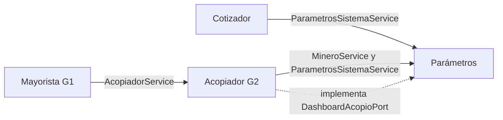

# LP2 · Comunicación entre módulos — SITRA-ORO U1

## Idea para la sustentación

> Es un monolito modular: los módulos viven en el mismo proceso y se comunican mediante
> interfaces Java públicas. No hay HTTP interno, Feign, colas ni acceso a repositorios ajenos.

## Módulos del alcance actual

| Módulo | Responsabilidad en U1 | Dependencias públicas |
|---|---|---|
| Parámetros | CRUD de mineros, parámetros vigentes y contrato del dashboard | Ninguna |
| Cotizador | Calcula una estimación en memoria | `ParametrosSistemaService` |
| Acopiador G2 | Registra compras, consulta por minero y administra lotes disponibles | `MineroService`, `ParametrosSistemaService` |
| Mayorista G1 | Crea la liquidación cabecera-detalle y cierra los lotes | `AcopiadorService` |

Seguridad es el quinto módulo del diseño general, pero su implementación JWT corresponde a S10.
En S06/U1 no existe un endpoint de login y no debe presentarse como terminado.

## Conexiones reales

| Desde → hacia | Contrato | Uso |
|---|---|---|
| Cotizador → Parámetros | `ParametrosSistemaService.obtenerVigentes()` | Precio diario y porcentaje de merma |
| Acopiador → Parámetros | `MineroService.obtenerEntidad(id)` | Comprueba que el minero relacionado existe |
| Acopiador → Parámetros | `ParametrosSistemaService.obtenerVigentes()` | Precio oficial cuando la compra no envía uno |
| Mayorista → Acopiador | `AcopiadorService.descontarStockOro(color, gramos, idLiquidacion)` | Marca los lotes cerrados dentro de la misma transacción |
| Dashboard ← Acopiador | `DashboardAcopioPort` + `DashboardAcopioAdapter` | Parámetros define el puerto y Acopiador aporta los agregados |

Los repositorios `MineroRepository`, `ParametrosSistemaRepository`, `TransaccionG2Repository` y
`LiquidacionG1Repository` permanecen internos a su módulo.

## Por qué el rollback cruza los módulos

`procesarLiquidacionSemanal()` abre la transacción. La llamada a `AcopiadorService` ocurre en el
mismo hilo y `DataSource`, por lo que participa en esa misma transacción. Si falla el segundo
color, Spring revierte los `INSERT` de cabecera/detalles y los cambios hechos al primer color.

La prueba `MayoristaServiceIntegrationTest.errorEnSegundoDetalle_revierteCabeceraDetallesYPrimerDescuento`
verifica exactamente ese escenario.

## Evidencia de los límites

`ModularityTests` ejecuta `modules.verify()`. Spring Modulith detecta `acopio.parametros`,
`acopio.cotizador`, `acopio.acopiador` y `acopio.mayorista` como módulos anidados. La documentación
generada queda en `target/spring-modulith-docs/module-acopio.*.adoc`.

Frase de cierre:

> Mayorista conoce el contrato de Acopiador, pero no su repositorio. Por eso la operación puede
> ser atómica sin romper el límite modular.
