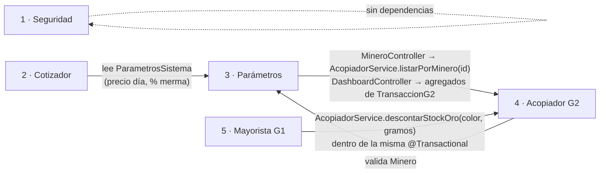

# LP2 · Cómo se comunican y conectan los 5 módulos — SITRA-ORO

Guion para la sustentación de S06. Todo está en el código actual, sin cambios.

## Idea central (una frase)

> Es un **monolito modular**: los 5 módulos son paquetes dentro de un mismo
> proyecto, corren en la **misma JVM** contra una **sola base de datos**, y se
> comunican por **llamadas a métodos Java a través de interfaces públicas** —
> no hay HTTP interno, ni Feign, ni colas.

## Los 5 módulos

| # | Módulo | Paquete | Endpoint(s) | Rol |
|---|--------|---------|-------------|-----|
| 1 | Seguridad | `acopio.seguridad` | `POST /api/v1/auth/login` | Login (JWT real en U2). **Aislado**: no llama a nadie. |
| 2 | Cotizador | `acopio.cotizador` | `GET /api/v1/cotizador/estimar` | Cotización estimada pública. Solo lectura, no persiste. |
| 3 | Parámetros | `acopio.parametros` | `/api/v1/acopio/mineros/**`, `GET /api/v1/dashboard/consolidado` | CRUD de mineros + cotización diaria + consolidado. |
| 4 | Acopiador (G2) | `acopio.acopiador` | `/api/v1/acopio/transacciones`, `/acumulados-semanales` | Compra directa al minero. Acumula stock de oro por color. |
| 5 | Mayorista (G1) | `acopio.mayorista` | `/api/v1/mayorista/liquidaciones`, `/resumen` | Liquidación semanal cabecera-detalle. Consume el stock. |

## Quién llama a quién (dependencias reales)



### Detalle de cada conexión (con el archivo real)

| Desde | Hacia | Cómo (código) | Para qué |
|---|---|---|---|
| **5 Mayorista → 4 Acopiador** | `MayoristaServiceImpl` inyecta `AcopiadorService` (interfaz) | `acopiadorService.descontarStockOro(tipoOro, pesoFundidoG)` por cada línea del detalle | Descontar stock de oro al liquidar. **Conexión clave.** |
| **4 Acopiador → 3 Parámetros** | `AcopiadorServiceImpl` inyecta `MineroRepository` | `mineroRepository.findById(idMinero).orElseThrow(...)` | Validar que el minero de la compra existe |
| **2 Cotizador → 3 Parámetros** | `CotizadorServiceImpl` inyecta `ParametrosSistemaRepository` | `findFirstByEstadoOrderByFechaDesc("ACTIVO")` | Tomar precio del día y % de merma vigentes |
| **3 Parámetros → 4 Acopiador** | `MineroController` inyecta `AcopiadorService` | `acopiadorService.listarPorMinero(id)` | Endpoint `GET /mineros/{id}/transacciones` |
| **3 Parámetros → 4 Acopiador** | `DashboardController` inyecta `TransaccionG2Repository` | `sumPesoFundidoByTipoOro(...)`, `sumTotalPagadoByTipoOro(...)` | Consolidado de gramos y montos por color |
| dentro de **4 Acopiador** | `AcopiadorServiceImpl` inyecta `CalculadorPrecioOroService` (interfaz) | `determinarPrecioAplicado(...)` | Estrategia de precio — patrón D de SOLID (inyección de interfaz, no `new`) |

## Cómo se comunican — los 4 puntos que el docente quiere oír

1. **Misma JVM, un solo `DataSource` Oracle (`XEPDB1` / `BOMERP_APP`).**
   La comunicación entre módulos es una **llamada a método Java normal**. No hay
   red, no hay serialización, no hay latencia.

2. **Un módulo nunca importa el `...ServiceImpl` de otro.**
   Importa la **interfaz pública** (`AcopiadorService`, `MineroService`,
   `CalculadorPrecioOroService`). Spring inyecta la implementación en tiempo de
   ejecución → **inversión de dependencias (D de SOLID)**. Si mañana cambia la
   implementación de Acopiador, Mayorista no se entera.

3. **Comparten la transacción del que llama.**
   Cuando `MayoristaServiceImpl.procesarLiquidacionSemanal()` (anotado
   `@Transactional`) llama a `AcopiadorService.descontarStockOro()`, esa llamada
   corre **en la misma transacción**. Si la línea 3 de 5 no tiene stock →
   `StockInsuficienteException` → **ROLLBACK de todo**: las 3 líneas insertadas y
   la cabecera. Atomicidad de punta a punta entre 2 módulos.

4. **Spring Modulith verifica las fronteras.**
   `ModularityTests` (`modules.verify()`) comprueba en cada `mvn test` que no
   haya ciclos ni accesos a paquetes internos prohibidos.

## Si preguntan por qué no son 5 módulos separados en Spring Modulith

Los 5 son **sub-dominios del módulo `acopio`**, no 5 módulos raíz. Razón de
diseño: **Acopiador y Parámetros se necesitan mutuamente**
(Acopiador valida `Minero`; el Dashboard de Parámetros lee transacciones de
Acopiador). Esa dependencia bidireccional se resuelve manteniéndolos como
sub-áreas de un mismo módulo cohesionado, en vez de forzar una separación
artificial. La comunicación **sigue siendo por interfaz pública** en todos los
casos — que es lo que define un diseño modular, no la cantidad de paquetes raíz.

## Demo de la comunicación en vivo (30 segundos)

```powershell
# Provoca la conexión Mayorista -> Acopiador con rollback:
$rollback = @{ nombreAcopiadorG2="Demo"; cotizacionOnzaUsd=2650; tipoCambioUsdPen=3.75
              detalles=@(@{tipoOro="VERDE"; pesoFundidoG=999999}) } | ConvertTo-Json -Depth 5
try { Invoke-RestMethod -Method Post "http://localhost:8081/api/v1/mayorista/liquidaciones" -ContentType application/json -Body $rollback }
catch { "HTTP " + $_.Exception.Response.StatusCode.value__ }   # -> HTTP 409
```

Luego se muestra en el log (`logs/bomerp.log` o Loki) la línea:
`WARN ... StockInsuficienteException provocando Rollback (409 Conflict)` — con su
`traceId` — y en la BD que **no quedó ninguna fila** en `LIQUIDACIONES_G1` ni en
`DETALLE_LIQUIDACIONES_G1`.
